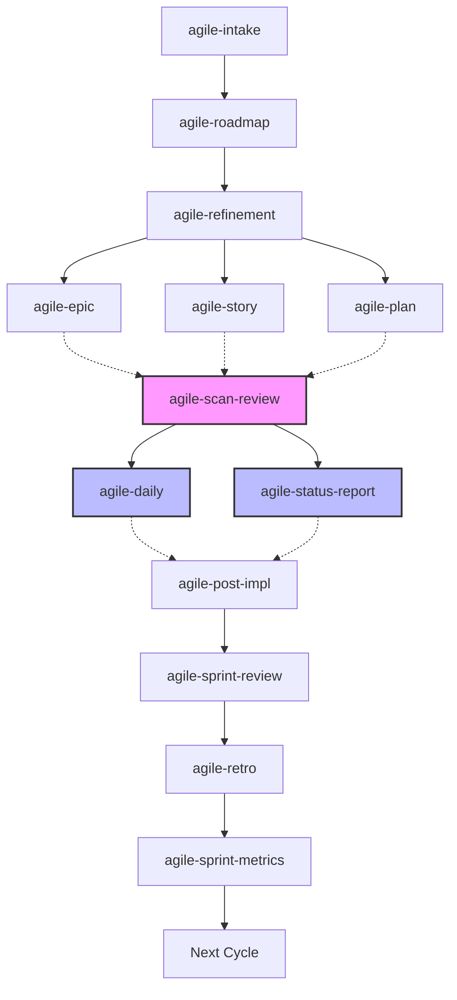

# Essential Skills — Zomme Delivery Framework

Skills for agile delivery management powered by AI agents (opencode).

## Installing

```bash
# All skills
npx skills add zomme/essential-skills --all

# Specific skills
npx skills add zomme/essential-skills --skill agile-daily --skill agile-plan
```

## Skills (22)

| # | Skill | Category |
|---|-------|----------|
| 1 | agile-daily | Agile |
| 2 | agile-status-report | Agile |
| 3 | agile-post-impl | Agile |
| 4 | agile-delivery | Agile |
| 5 | agile-plan | Agile |
| 6 | agile-story | Agile |
| 7 | agile-epic | Agile |
| 8 | agile-refinement | Agile |
| 9 | agile-roadmap | Agile |
| 10 | agile-planning-router | Agile |
| 11 | agile-ceremonies-router | Agile |
| 12 | agile-sprint-planning | Agile |
| 13 | agile-sprint-review | Agile |
| 14 | agile-sprint-metrics | Agile |
| 15 | agile-retro | Agile |
| 16 | agile-scan-review | Agile |
| 17 | agile-proto | Agile |
| 18 | agile-intake | Agile |
| 19 | agile-onboarding | Agile |
| 20 | wiki-ingest | Wiki |
| 21 | wiki-lint | Wiki |
| 22 | wiki-query | Wiki |

## Wiki (Karpathy Pattern)

This project uses the **LLM Wiki** pattern to maintain versioned, AI-consultable organizational knowledge.

### How it works

Each project that installs these skills creates its own local `wiki/`. Skills ingest sources (notes, decisions, documents) and the AI consults the wiki before answering domain questions.

### Structure created by the project

```
wiki/
├── CONVENTIONS.md   # Schema, frontmatter, operations
├── index.md         # Navigable catalog
├── log.md           # Operation history
├── sources/         # Source summaries
├── business/        # Business rules (audience: business)
├── ops/             # Operational procedures (audience: ops)
└── patterns/       # Patterns identified in practice
raw/                 # Original sources (before ingestion)
```

### Wiki Skills

| Skill | When to use |
|-------|-------------|
| `/wiki-ingest` | Ingest new source into wiki (documents, notes, decisions) |
| `/wiki-query` | Ask about something in the wiki |
| `/wiki-lint` | Audit and organize the wiki |

### Project setup

When installing in a new project, create the initial structure:

```bash
mkdir -p wiki/sources raw
touch wiki/CONVENTIONS.md wiki/index.md wiki/log.md
```

The project's AGENTS.md instructs the AI to consult the wiki before answering domain questions.

Inspired by [LLM Wiki — Karpathy](https://gist.github.com/karpathy/442a6bf555914893e9891c11519de94f).

## Documentation

[`docs/`](docs/) — usage guides organized by category.

## Workflow



## Stack

- opencode as AI agent
- Bun as runtime
- Lean Scrum + AI as pair

## How to use

Each skill is invoked with `/skill-name`:

```
/agile-intake
/agile-refinement
/agile-plan
/agile-story
/agile-daily
/wiki-query
/wiki-ingest
```

To know which skill to use:
- `/agile-delivery` — which tracking type
- `/agile-planning-router` — which planning artifact
- `/agile-ceremonies-router` — which ceremony
