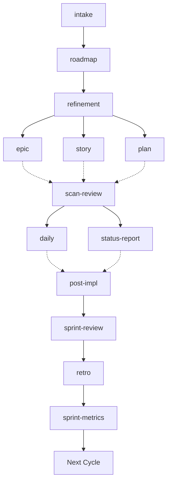

# Essential Skills — Documentation

Usage guides organized by category.

## Agile — Delivery

| Skill | Usage |
|-------|-------|
| [agile-daily](agile/agile-daily.md) | Daily status: progress, blockers, next step |
| [agile-status-report](agile/agile-status-report.md) | Period/milestone consolidated status |
| [agile-post-impl](agile/agile-post-impl.md) | Delivery closure with verification |
| [agile-delivery](agile/agile-delivery.md) | Router: which tracking type to use |

## Agile — Planning

| Skill | Usage |
|-------|-------|
| [agile-plan](agile/agile-plan.md) | Small change (XS/S) → execution plan |
| [agile-story](agile/agile-story.md) | Medium delivery (M) → story with acceptance criteria |
| [agile-epic](agile/agile-epic.md) | Large initiative → story backlog + roadmap |
| [agile-refinement](agile/agile-refinement.md) | Large backlog → executable stories |
| [agile-roadmap](agile/agile-roadmap.md) | Quarterly or epic roadmap |
| [agile-planning-router](agile/agile-planning-router.md) | Router: which planning artifact to use |

## Agile — Ceremonies

| Skill | Usage |
|-------|-------|
| [agile-ceremonies-router](agile/agile-ceremonies-router.md) | Router: which Scrum ceremony to run |
| [agile-sprint-planning](agile/agile-sprint-planning.md) | Plan cycle: objective, items, capacity |
| [agile-sprint-review](agile/agile-sprint-review.md) | Review + demo for stakeholders |
| [agile-sprint-metrics](agile/agile-sprint-metrics.md) | Objective sprint metrics |
| [agile-retro](agile/agile-retro.md) | Retrospective with improvement actions |

## Agile — Quality

| Skill | Usage |
|-------|-------|
| [agile-scan-review](agile/agile-scan-review.md) | Review code before commit/PR |
| [agile-proto](agile/agile-proto.md) | Interactive UI prototypes |

## Agile — Intake

| Skill | Usage |
|-------|-------|
| [agile-intake](agile/agile-intake.md) | Vague problems → structured intake document |
| [agile-onboarding](agile/agile-onboarding.md) | New member onboarding |

## Wiki (Karpathy Pattern)

AI-maintained organizational knowledge system.

| Skill | Usage |
|-------|-------|
| [wiki-ingest](wiki/wiki-ingest.md) | Ingest new source into wiki |
| [wiki-query](wiki/wiki-query.md) | Ask about something in the wiki |
| [wiki-lint](wiki/wiki-lint.md) | Audit and organize the wiki |

**Note:** Wiki skills operate on the project's own `wiki/` folder. Each project manages its own local wiki.

## Complete Workflow

