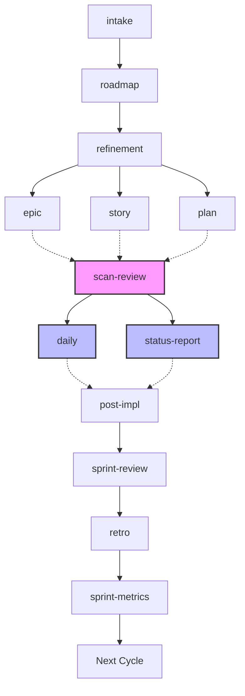

# Agile Workflow

Skills for agile delivery management powered by AI agents.

## Language

All artifacts (intake, roadmap, epic, story, plan, etc.) must be written in **the user's language**:
- If the user communicates in Portuguese, write the entire artifact in Portuguese with correct grammar and accents.
- If the user communicates in English, write in English.
- **When in doubt, ask the user** which language they prefer before generating the artifact.
- Templates are in English as reference structure. Translate section headers and content to match the user's language.
- Technical terms, code identifiers, tool references (`/plan`, `/story`, etc.), and file paths remain unchanged regardless of language.

## Mermaid diagrams

Use Mermaid diagrams for flows, dependencies, timelines, and architecture. Never use ASCII art.
- Use ` ` for line breaks inside node labels, **never** `\n`. Example: `A["Line 1 Line 2"]`.

## Workflow

## Guides

Scenario-based guides showing how skills chain together in real situations.

| Guide                                                              | What you'll learn                                                 |
| ------------------------------------------------------------------ | ----------------------------------------------------------------- |
| [From Idea to Delivery](guides/from-idea-to-delivery.md)           | End-to-end: intake → plan/story → scan-review → daily → post-impl |
| [Managing Large Initiatives](guides/managing-large-initiatives.md) | Epic-scale: roadmap → refinement → epic → stories → status-report |
| [Sprint Lifecycle](guides/sprint-lifecycle.md)                     | Ceremonies: planning → daily → review → metrics → retro           |
| [Getting Started](guides/getting-started.md)                       | Onboarding, prototyping, decision trees, and cheat sheet          |

## Skills

Each skill README contains full documentation with examples, tips, and chaining info.

### Intake & Planning

| Skill | Usage |
|-------|-------|
| [intake](../../skills/agile-intake/README.md) | Vague problems → structured intake document |
| [planning-router](../../skills/agile-planning-router/README.md) | Router: plan vs story vs epic |
| [plan](../../skills/agile-plan/README.md) | Small, localized change → execution plan |
| [story](../../skills/agile-story/README.md) | Medium-sized delivery → story with acceptance criteria |
| [epic](../../skills/agile-epic/README.md) | Large initiative → story backlog + roadmap |
| [refinement](../../skills/agile-refinement/README.md) | Large backlog → executable stories |
| [roadmap](../../skills/agile-roadmap/README.md) | Quarterly or epic roadmap |

### Delivery & Tracking

| Skill | Usage |
|-------|-------|
| [daily](../../skills/agile-daily/README.md) | Daily status: progress, blockers, next step |
| [status-report](../../skills/agile-status-report/README.md) | Period/milestone consolidated status |
| [post-impl](../../skills/agile-post-impl/README.md) | Delivery closure with verification |
| [delivery](../../skills/agile-delivery/README.md) | Router: daily vs status-report vs post-impl |

### Sprint Ceremonies

| Skill | Usage |
|-------|-------|
| [ceremonies-router](../../skills/agile-ceremonies-router/README.md) | Router: which ceremony to run |
| [sprint-planning](../../skills/agile-sprint-planning/README.md) | Plan cycle: objective, items, capacity |
| [sprint-review](../../skills/agile-sprint-review/README.md) | Review + demo for stakeholders |
| [sprint-metrics](../../skills/agile-sprint-metrics/README.md) | Objective sprint metrics |
| [retro](../../skills/agile-retro/README.md) | Retrospective with improvement actions |

### Quality & Prototyping

| Skill | Usage |
|-------|-------|
| [scan-review](../../skills/agile-scan-review/README.md) | Review code before commit/PR |
| [proto](../../skills/agile-proto/README.md) | Interactive UI prototypes |

### Onboarding

| Skill | Usage |
|-------|-------|
| [onboarding](../../skills/agile-onboarding/README.md) | New member onboarding guide |
