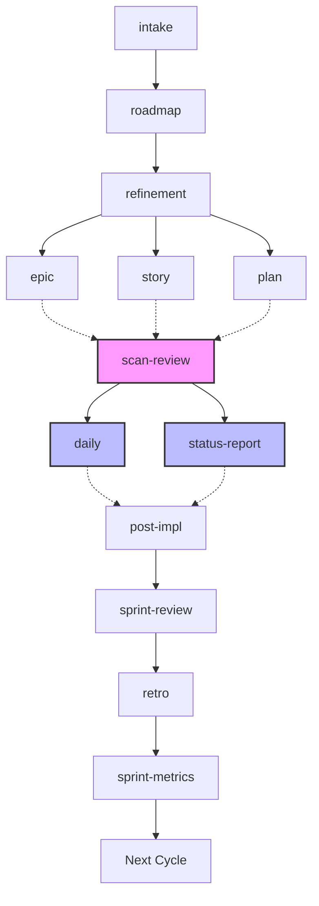

# Agile Workflow

Skills for agile delivery management powered by AI agents (opencode).

## Workflow

## Skills

| Skill | Usage |
|-------|-------|
| [agile-daily](agile-daily.md) | Daily status: progress, blockers, next step |
| [agile-status-report](agile-status-report.md) | Period/milestone consolidated status |
| [agile-post-impl](agile-post-impl.md) | Delivery closure with verification |
| [agile-delivery](agile-delivery.md) | Router: which tracking type to use |
| [agile-plan](agile-plan.md) | Small change (XS/S) → execution plan |
| [agile-story](agile-story.md) | Medium delivery (M) → story with acceptance criteria |
| [agile-epic](agile-epic.md) | Large initiative → story backlog + roadmap |
| [agile-refinement](agile-refinement.md) | Large backlog → executable stories |
| [agile-roadmap](agile-roadmap.md) | Quarterly or epic roadmap |
| [agile-planning-router](agile-planning-router.md) | Router: which planning artifact to use |
| [agile-ceremonies-router](agile-ceremonies-router.md) | Router: which Scrum ceremony to run |
| [agile-sprint-planning](agile-sprint-planning.md) | Plan cycle: objective, items, capacity |
| [agile-sprint-review](agile-sprint-review.md) | Review + demo for stakeholders |
| [agile-sprint-metrics](agile-sprint-metrics.md) | Objective sprint metrics |
| [agile-retro](agile-retro.md) | Retrospective with improvement actions |
| [agile-scan-review](agile-scan-review.md) | Review code before commit/PR |
| [agile-proto](agile-proto.md) | Interactive UI prototypes |
| [agile-intake](agile-intake.md) | Vague problems → structured intake document |
| [agile-onboarding](agile-onboarding.md) | New member onboarding |
