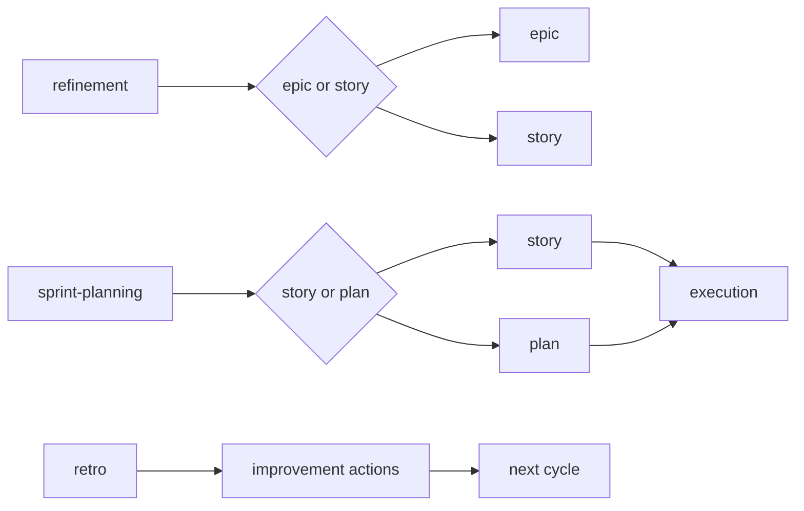

# Scrum Ceremonies (Router)

Decides which Scrum ceremony is appropriate and directs to the correct skill.

## When to use

When you need to lead a ceremony but don't know which one to use.

## How to use

```
/scrum-ceremonies
```

With context:

```
/scrum-ceremonies Sprint 23 is starting
/scrum-ceremonies Sprint 22 finished
```

## Decision tree

| Situation | Ceremony | Skill |
|----------|-----------|-------|
| Large or ambiguous backlog item | Refinement | `/refinement` |
| Starting a work cycle | Sprint Planning | `/sprint-planning` |
| Finished a cycle or delivery | Retrospective | `/retro` |

## Tip

Every ceremony must generate a **clear and reusable artifact**. If the discussion doesn't become a backlog or actions, it's not done.

## Flow relationship


