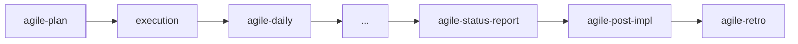

# agile-delivery

Orchestrates delivery tracking by routing you to the right tracking skill — daily status, status report, or post-implementation report. Use it when you know you need to track progress but aren't sure which format fits the moment.

## When to use

- You need to track delivery progress but don't know whether to use a daily, status report, or post-impl report
- Someone asks "what's the status?" and you need guidance on the right response format
- You're halfway through a sprint and want the appropriate tracking mechanism

## When NOT to use

- You already know which tracking format you need — invoke `/agile-daily`, `/agile-status-report`, or `/agile-post-impl` directly
- You need to plan work — use `/agile-sprint-planning` or `/agile-plan` instead
- You need to create a new artifact — use `/agile-intake` or `/agile-story` instead

## End-to-end examples

### Example 1: Mid-sprint status check for payments team

The payments team lead asks "what's the status on the Stripe integration?" and you're not sure which tracker to use:

1. Start by invoking: `/agile-delivery`
2. The skill asks: "What type of tracking do you need? Quick daily status, period consolidation, or delivery closure?"
3. You explain: "It's day 3 of a 5-day sprint and I need to report to the lead."
4. The skill routes you to: `/agile-daily` (for an in-sprint checkpoint) and explains: "A daily update is right here — you need a snapshot of current progress, not a period consolidation."
5. You invoke `/agile-daily stripe-integration` and get the status.

### Example 2: End-of-milestone consolidation

The quarter ends and you need to summarize everything shipped:

1. Start by invoking: `/agile-delivery`
2. The skill asks: "What type of tracking do you need?"
3. You explain: "The quarter just ended and I need to consolidate all deliveries and deviations."
4. The skill routes you to: `/agile-status-report` (for period consolidation) and explains: "This is a consolidation of a period — use the status report format."
5. You invoke `/agile-status-report Q1-2026` and get the report.

### Example 3: Closing a completed delivery

You just finished implementing the password reset feature and want to formally close it:

1. Start by invoking: `/agile-delivery`
2. The skill asks what type of tracking you need.
3. You say: "The delivery is done, everything passes, I need to close it out."
4. The skill routes you to: `/agile-post-impl` (for delivery closure) and explains: "Since the work is finished, you need a post-implementation report to verify and formally close."
5. You invoke `/agile-post-impl password-reset`.

## Workflow integration

## Tips & pitfalls

- This is a router skill — it doesn't produce an artifact. It sends you to the right skill.
- If you already know you need a daily/status-report/post-impl, skip this and go directly.
- Every update must reflect real state, not optimistic intention. Don't report "almost done" when tasks are incomplete.

## Chaining

- **Before:** Any planning or execution skill (the delivery tracks progress against a plan)
- **After:** Routes to `/agile-daily`, `/agile-status-report`, or `/agile-post-impl` depending on context.