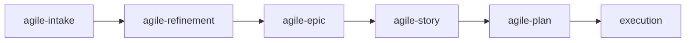

# agile-epic

Structures large initiatives (size L or XL) into a story backlog with a roadmap, dependencies, and verification criteria. Use when work requires several coordinated stories, has cross-dependencies between deliveries, or needs a phased roadmap to guide execution.

## When to use

- After a `/agile-refinement` that generated several stories that need coordination
- An initiative is size L or XL and can't be a single story
- There are dependencies between deliveries that need explicit sequencing
- A roadmap is needed to show phases, unblocks, and intermediate validations

## When NOT to use

- The work fits in a single story (size M) — use `/agile-story` instead
- The work is small and localized (XS or S) — use `/agile-plan` instead
- The problem hasn't been analyzed yet — use `/agile-intake` or `/agile-refinement` first
- You just need to track progress — use `/agile-daily` instead

## End-to-end examples

### Example 1: Structuring a multi-story payment system overhaul

The team needs to overhaul the payment system, touching billing, invoices, and payouts:

1. Start by invoking: `/agile-epic payment-system-overhaul`
2. The skill reads the existing intake at `planning/payment-system/intake.md` and the refinement at `planning/payment-system/refinement.md`.
3. It identifies: macro problem (legacy payment provider causing 15% failure rate), stories already identified (Stripe integration, webhook handler, payout reconciliation), constraints (no downtime, PCI compliance).
4. You fill in the epic sections: context (AS-IS: manual reconciliation, 15% failure; TO-BE: automated, <1% failure), story backlog (5 stories with sizes and dependencies), roadmap (3 phases), risks (PCI audit in Q2, migration can't run on Fridays).
5. The skill produces `planning/payment-system-overhaul/epic.md` with:
   - Story 1: Stripe provider integration (S, no deps) — Phase 1
   - Story 2: Webhook event handler (M, depends on 1) — Phase 1
   - Story 3: Payout reconciliation (M, depends on 1) — Phase 2
   - Story 4: Invoice migration (L, depends on 1, 2) — Phase 2
   - Story 5: Legacy decommission (S, depends on 1-4) — Phase 3
6. Save to: `planning/payment-system-overhaul/epic.md`
7. The skill suggests: "Do you want to detail Story 1 with `/agile-story`?"

### Example 2: Breaking down a platform migration

A monolith-to-microservices migration has been discussed but never structured:

1. Start by invoking: `/agile-epic platform-migration`
2. The skill asks: "Which initiative will be structured? Is there an intake or refinement?"
3. You point to `planning/platform-migration/refinement.md` which identifies 6 stories.
4. The skill structures the epic with phases: Phase 1 (extract auth service), Phase 2 (extract orders service), Phase 3 (kill monolith), with parallel tracks where possible.
5. Save to: `planning/platform-migration/epic.md`

## Workflow integration

## Tips & pitfalls

- The epic organizes and sequences stories — it does not replace them. Each story still needs its own `/agile-story` or `/agile-plan`.
- Break by vertical value slices, not by technical layers. "Stripe integration" is a good story; "backend changes" is not.
- The roadmap must show dependencies and unblocks, not just chronological order. Highlight the critical path.
- Update story statuses (not started → in progress → completed) as the epic progresses.

## Chaining

- **Before:** `/agile-intake` (capture the problem), `/agile-refinement` (decompose into stories)
- **After:** `/agile-story` (detail individual stories), `/agile-plan` (create execution plans for stories)