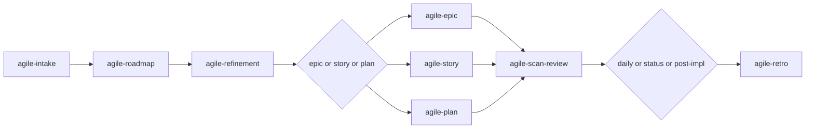

# agile-onboarding

Guides new team members through the agile + AI workflow in a progressive, hands-on 5-day trail. It covers the entire pipeline from intake to retrospective, ensuring the new member can operate autonomously within 1-2 sprints. Onboarding is practice, not passive reading.

## When to use

- A new dev or manager joins the team
- Someone changes roles (e.g., dev becomes tech lead)
- The team adopts the agile + AI flow for the first time
- Someone returns after time away and needs retraining

## When NOT to use

- You just need to plan work — use `/agile-sprint-planning` or `/agile-plan` instead
- You need to create an artifact — use the specific skill (intake, story, etc.)
- You want to track progress — use `/agile-daily` instead
- You need a code review — use `/agile-scan-review` instead

## End-to-end examples

### Example 1: Onboarding a new backend developer

A new backend dev joins the team and needs to learn the flow:

1. Start by invoking: `/agile-onboarding`
2. The skill presents the 5-day trail:
   - **Day 1 — Understand the model:** Walk through the complete flow (intake → roadmap → refinement → epic/story/plan → execution → daily → post-impl → retro). Explain role division (human decides, AI structures). Show the decision tree for planning artifacts. List all available skills.
   - **Day 2 — Practical exercise (intake + planning):** The new dev picks a real small problem (e.g., "add rate limiting to the API"). They run `/agile-intake rate limiting`, then use `/agile-planning-router` to decide it's an S → `/agile-plan`. The mentor reviews the plan.
   - **Day 3 — Practical exercise (TDD):** The dev implements the rate limiting plan using TDD with AI as pair: write failing test (red), implement (green), refactor. Run lint, typecheck, tests. Review the diff.
   - **Day 4 — Practical exercise (tracking):** The dev generates a `/agile-daily` for the rate limiting work, simulates a `/agile-status-report` for the week, and closes with `/agile-post-impl`.
   - **Day 5 — Reflection and autonomy:** The dev does a full solo cycle: intake → plan → TDD → daily → post-impl. The mentor validates and gives final feedback.
3. At the end, the dev completes the onboarding checklist:
   - [ ] Understands the complete flow (intake to retro)
   - [ ] Knows how to choose the right artifact (decision tree)
   - [ ] Can create plan or story with AI support
   - [ ] Knows how to use TDD with AI as pair
   - [ ] Can generate daily and post-impl reports
   - [ ] Understands the human vs AI responsibility division
   - [ ] Knows which skills exist and when to use each one
   - [ ] Completed at least one full cycle with supervision

### Example 2: Onboarding a new scrum master

A new scrum master joins and needs to learn the ceremony skills:

1. Start by invoking: `/agile-onboarding`
2. The skill adapts the trail for a management profile:
   - Focus on: `/agile-roadmap`, `/agile-refinement`, `/agile-sprint-planning`, `/agile-retro`, `/agile-status-report`
   - Extra exercise: conduct a `/agile-refinement` for a real backlog item, then run `/agile-sprint-planning` with AI support
   - Less focus on TDD implementation details, more on structuring and tracking
3. The scrum master completes the same checklist with management emphasis.

### Example 3: Quick retraining after extended leave

A dev returns after 3 months away and needs a refresher:

1. Start by invoking: `/agile-onboarding`
2. The skill skips Day 1 (model already known) and focuses on Days 2-4 with the latest flow changes.
3. The dev completes the checklist items they're rusty on (e.g., new skills, updated templates).

## Workflow integration

## Tips & pitfalls

- Onboarding is not passive. The new member must practice, not just read documentation.
- The mentor guides and reviews — they don't do the work for the new member.
- Mistakes during onboarding are learning opportunities. The environment must be safe to experiment.
- If the new member can't complete the checklist in 5 working days, the problem may be the process, not the person. Discuss in a retro.
- Adapt the trail by profile: devs need more TDD focus, managers need more ceremony focus, tech leads need both.

## Chaining

- **Before:** Nothing — onboarding is the entry point before any other skill.
- **After:** The new member should be able to use `/agile-planning-router`, `/agile-daily`, `/agile-delivery`, `/agile-ceremonies-router`, and `/agile-scan-review` autonomously.