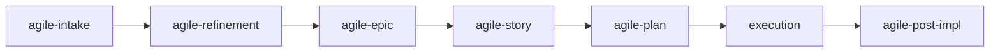

# agile-plan

Creates a simple, proportionally-sized execution plan for localized changes (size XS or S). It maps exact files, defines verifiable tasks, and produces a checklist-ready artifact that can be implemented immediately. It's the last step before writing code.

## When to use

- Small and localized work (XS or S) — a bug fix, a config change, a single feature
- Few impacted files and a single implementation cycle
- A story from an epic or refinement that needs an operational plan before coding
- The problem is already clear and you just need to map out what to change

## When NOT to use

- Medium or large work (M+) — use `/agile-story` or `/agile-epic` instead
- The problem isn't clear yet — use `/agile-intake` first
- Multiple dependent deliveries — use `/agile-epic` instead
- You need to break down a large initiative — use `/agile-refinement` first

## End-to-end examples

### Example 1: Planning a bug fix for password reset expiry

A bug report shows password reset tokens never expire:

1. Start by invoking: `/agile-plan password reset tokens not expiring`
2. The skill asks: "What's the problem? Any context or issue reference?"
3. You provide: "Bug: password reset tokens don't expire. Users can use old tokens indefinitely. Security risk."
4. The skill asks to explore the code. It identifies the relevant files:
   - `src/auth/tokens.ts` — alter (add expiry check)
   - `src/auth/password-reset.ts` — alter (pass expiry to token creation)
   - `src/__tests__/auth/tokens.test.ts` — alter (add expiry tests)
5. The skill builds the plan:
   - **Context:** Bug — reset tokens never expire. AS-IS: tokens are valid forever. TO-BE: tokens expire after 1 hour.
   - **Files:** exact paths with actions
   - **Tasks:** `[ ] Add EXPIRY_MS constant to tokens.ts`, `[ ] Update createResetToken to include expiry`, `[ ] Add isTokenExpired check in verifyResetToken`, `[ ] Write tests for expired tokens`, `[ ] Run lint, typecheck, tests`
   - **Verification:** `bun run lint`, `tsc --noEmit`, `bun test`, manual test in staging
6. The skill presents the plan and waits for your confirmation.
7. Save to: `.agents/plans/password-reset-expiry.md`
8. After confirmation, implement following the checklist.
9. When done, the skill suggests: `/agile-post-impl` to close the delivery.

### Example 2: Planning a small feature — add rate limiting to API

The team wants to add rate limiting to all public endpoints:

1. Start by invoking: `/agile-plan add rate limiting to public API endpoints`
2. The skill explores the codebase, finds the middleware stack, and identifies files.
3. It creates the plan with tasks: configure rate limiter, add middleware, add tests, verify in staging.
4. Save to: `.agents/plans/rate-limiting.md`
5. Implement, then close with `/agile-post-impl`.

## Workflow integration

## Tips & pitfalls

- Always present the plan before implementing. Get explicit user confirmation.
- Files must have exact paths, not vague areas like "the auth module". Explore the code first.
- Tasks must be verifiable — "implement X" is not a task; "add expiry check to verifyResetToken in tokens.ts" is.
- When a task is completed, update `[ ]` to `[x]` in the plan.
- If the work turns out to be bigger than expected mid-plan, stop and suggest `/agile-story` instead.

## Chaining

- **Before:** `/agile-intake` (capture problem), `/agile-story` (detail a story), `/agile-epic` (for larger initiatives)
- **After:** Execute the plan, then `/agile-post-impl` to formally close the delivery.