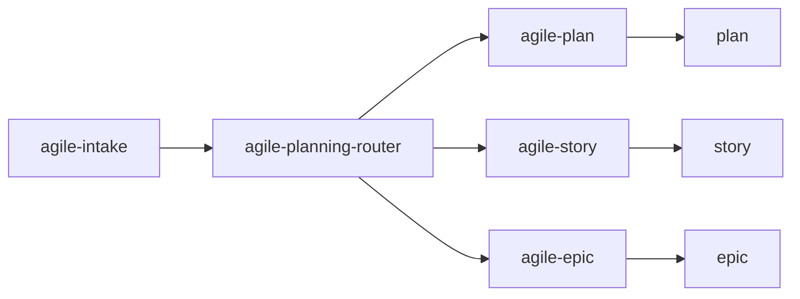

# agile-planning-router

Orchestrates the decision between a simple plan, a story, or an epic. Use when you have a problem or request but don't know which planning artifact is the right size — it evaluates complexity and routes you to the correct skill.

## When to use

- You have a request or problem and don't know if it needs a plan, story, or epic
- Someone brings work and you need to decide the proportional artifact size
- You want guidance on the planning flow before committing to a specific format
- You need to apply "light sizing" to determine XS/S → plan, M → story, L/XL → epic

## When NOT to use

- You already know the artifact type — invoke `/agile-plan`, `/agile-story`, or `/agile-epic` directly
- The problem isn't defined yet — use `/agile-intake` first
- There's ambiguity about scope — use `/agile-refinement` first
- You need strategic direction — use `/agile-roadmap` first

## End-to-end examples

### Example 1: Deciding the right artifact for a new feature request

The product team asks: "Add multi-language support to the onboarding flow":

1. Start by invoking: `/agile-planning-router add multi-language support to onboarding`
2. The skill evaluates: "Multi-language support touches i18n setup, translation files, UI components, and content management. This is size L — multiple stories with dependencies."
3. It recommends: `/agile-epic` because the initiative needs a roadmap and several coordinated stories.
4. You confirm and the skill says: "Run `/agile-epic multi-language-onboarding` to structure the backlog."

### Example 2: Quick bug fix — obviously a plan

A dev reports: "The CSV export breaks when there are special characters in field names":

1. Start by invoking: `/agile-planning-router CSV export breaks with special chars`
2. The skill evaluates: "This is a localized bug fix — one area, few files, simple validation. Size XS."
3. It recommends: `/agile-plan` directly.
4. You run `/agile-plan csv-export-special-chars` and get a plan in minutes.

### Example 3: Medium feature — needs a story

The team wants: "Build a notification system for order status changes":

1. Start by invoking: `/agile-planning-router notification system for order status`
2. The skill evaluates: "This is a vertical delivery — it touches the orders module, notifications service, and UI. Several files, moderate validation. Size M."
3. It recommends: `/agile-story` because it needs richer acceptance criteria than a plan but isn't multi-story coordination.
4. You run `/agile-story order-status-notifications`.

## Workflow integration

## Light sizing reference

| Size | Description | Artifact | Skill |
|---|---|---|---|
| XS | Localized adjustment, 1 file, low risk | Simple plan | `/agile-plan` |
| S | Small delivery, few files, simple validation | Simple plan | `/agile-plan` |
| M | Vertical delivery, several files, moderate validation | Story | `/agile-story` |
| L | Large story, needs to be broken down | Epic | `/agile-epic` |
| XL | Multi-story initiative, coordination needed | Epic | `/agile-epic` |

## Tips & pitfalls

- This is a router skill — it evaluates and directs, but doesn't produce the final artifact.
- If the problem isn't clear, it will suggest `/agile-intake` or `/agile-refinement` before routing to a planning skill.
- Don't overthink sizing. If it touches more than a few files and needs acceptance criteria beyond "it works", it's probably M (story). If it needs multiple coordinated stories, it's L/XL (epic).
- Every artifact (plan, story, or epic) must contain: context, files, detail, tasks, and verification.

## Chaining

- **Before:** `/agile-intake` (if problem isn't defined), `/agile-refinement` (if scope is ambiguous)
- **After:** Routes to `/agile-plan`, `/agile-story`, or `/agile-epic` based on size evaluation.