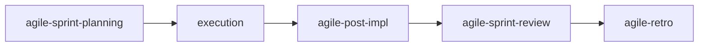

# agile-sprint-review

Consolidates sprint deliveries into a clear, objective review and demo format for stakeholders. It shows what was delivered, what changed in scope, what's pending, and what decisions are needed. The review shows what **was delivered**, not what's in progress — for status updates, use `/agile-daily` or `/agile-status-report`.

## When to use

- At the end of a sprint, before the retro
- Stakeholders need to see the result of deliveries
- You need to validate that the product is on track
- To close the cycle between sprint planning and retrospective

## When NOT to use

- Mid-sprint status — use `/agile-daily` or `/agile-status-report` instead
- Reflecting on process — use `/agile-retro` instead (review shows results, retro discusses process)
- Planning the next sprint — use `/agile-sprint-planning` instead
- Getting quantitative metrics — use `/agile-sprint-metrics` instead (review shows value, metrics show numbers)

## End-to-end examples

### Example 1: Sprint Review for Sprint 23 — payments team

Sprint 23 is done. Three stories were delivered and two were not. The product owner needs a demo:

1. Start by invoking: `/agile-sprint-review Sprint 23`
2. The skill collects data from: completed issues, post-impl reports, dailies, scope changes.

   **Deliveries:**
   - ✅ Stripe provider integration — delivered as planned
   - ✅ Webhook event handler — delivered with minor scope change (added idempotency)
   - ✅ Payout reconciliation — delivered, all acceptance criteria met
   - ❌ Customer migration — not delivered (blocked on migration strategy decision)
   - ❌ Legacy decommission — not delivered (depends on customer migration)

   **Scope changes:** Webhook handler added idempotency keys (not in original plan, but agreed mid-sprint)

   **Undelivered items:**
   - Customer migration: blocked → returns to backlog, needs refinement
   - Legacy decommission: dependency → moved to Sprint 24 if customer migration is resolved

3. The skill organizes the demo by business value:
   - "Now the team can process payments through Stripe end-to-end"
   - Demo: submit a test payment → webhook fires → payout reconciled
   - Technical context: idempotency keys ensure no duplicate processing

4. It collects stakeholder feedback:
   - "Need to discuss migration strategy in next refinement"
   - "Can we prioritize customer migration in Sprint 24?"
   - "Impressed with the idempotency addition"

5. Save to: `planning/sprints/sprint-23-review.md`

### Example 2: Lean sprint review for a solo dev

A solo dev finished a 1-week cycle with 2 of 3 items completed:

1. Start by invoking: `/agile-sprint-review week of April 7`
2. The skill consolidates: 2 items delivered (bug fix, config change), 1 postponed (feature needs more design).
3. It formats the review: what was delivered, what changed, what's next.
4. Presented inline (short review for a solo cycle).

## Workflow integration

## Tips & pitfalls

- The review shows what **was delivered**, not what is in progress. For in-progress status, use `/agile-daily` or `/agile-status-report`.
- Be honest about what was not delivered and why. Hiding cut items breaks stakeholder trust.
- Organize the demo by business value, not technical order. Start with impact: "Now users can pay with Stripe."
- The demo must be verifiable — stakeholders should be able to confirm the result is real.
- Collected feedback must become backlog items or actions, not just meeting notes.

## Chaining

- **Before:** `/agile-post-impl` (close deliveries first), `/agile-sprint-metrics` (get quantitative data)
- **After:** `/agile-retro` (discuss process, not results), `/agile-sprint-planning` (feedback feeds next sprint)