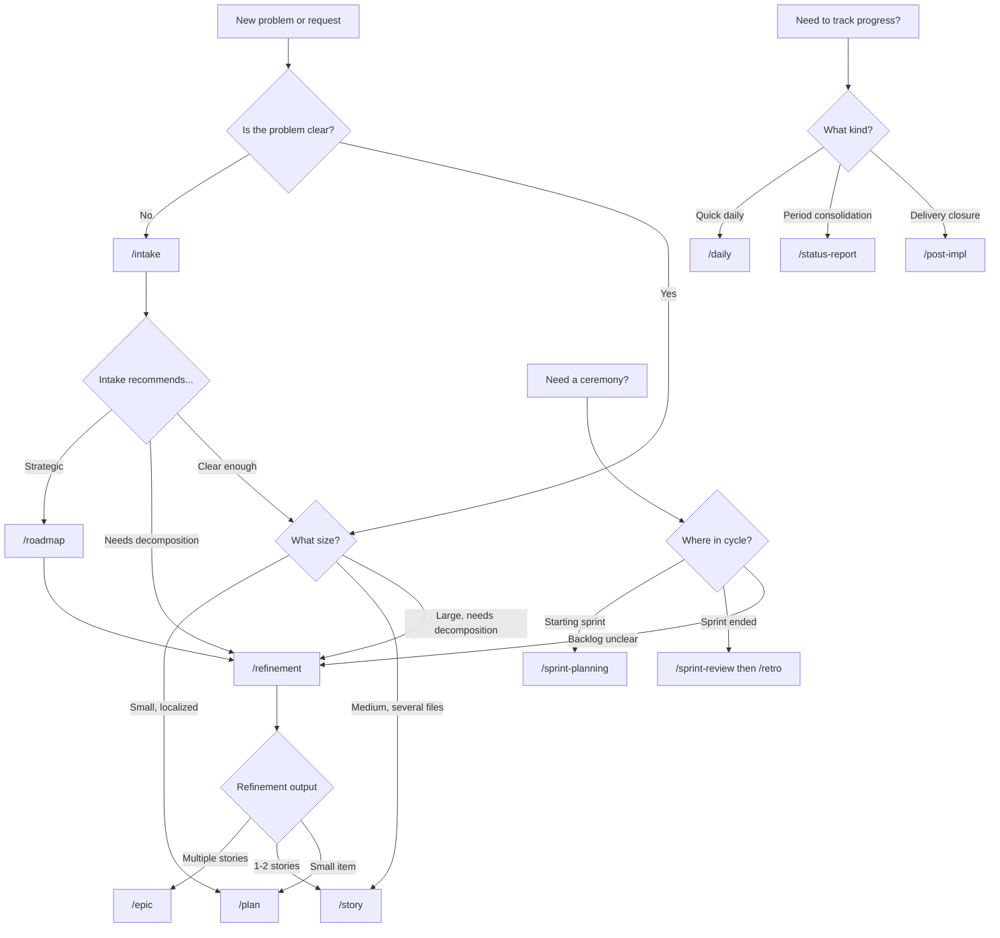

# Getting Started

How to onboard into the agile + AI workflow, choose the right skill, and validate ideas with prototypes before committing to implementation.

**Skills covered:** onboarding, proto, planning-router, ceremonies-router, delivery

---

## Quick reference: Which skill do I use?

### Decision tree



### Cheat sheet

| I need to... | Use |
|---|---|
| Capture a vague problem | `/intake` |
| Decide plan vs story vs epic | `/planning-router` |
| Plan a small, localized change | `/plan` |
| Detail a medium-sized delivery | `/story` |
| Break down a large item before creating an epic | `/refinement` |
| Structure a large initiative | `/epic` (after `/refinement`) |
| Set strategic direction | `/roadmap` (then `/refinement`) |
| Quick daily status | `/daily` |
| Period/milestone consolidation | `/status-report` |
| Close a delivery formally | `/post-impl` |
| Choose the right ceremony | `/ceremonies-router` |
| Plan a sprint | `/sprint-planning` |
| Demo deliveries to stakeholders | `/sprint-review` |
| Get sprint numbers | `/sprint-metrics` |
| Reflect and improve | `/retro` |
| Review code before committing | `/scan-review` |
| Validate a UI flow interactively | `/proto` |
| Choose the right tracking format | `/delivery` |
| Onboard a new team member | `/onboarding` |

---

## Scenario A — Onboarding a new backend developer

A new backend dev joins the team and needs to learn the flow.

### The 5-day trail

```
/onboarding
```

**Day 1 — Understand the model:**
- Walk through the complete flow: intake → roadmap → refinement → epic/story/plan → execution → daily → post-impl → retro
- Explain role division: human decides, AI structures
- Show the decision tree above
- List all available skills

**Day 2 — Practical exercise (intake + planning):**
- Pick a real small problem (e.g., "add rate limiting to the API")
- Run `/intake rate limiting` → skill asks questions, structures the problem
- Use `/planning-router` to decide: it's a small change → `/plan`
- Create the plan. Mentor reviews.

**Day 3 — Practical exercise (TDD + execution):**
- Implement the rate limiting plan using TDD with AI as pair
- Write failing test (red), implement (green), refactor
- Run lint, typecheck, tests
- Run `/scan-review` — review the diff together

**Day 4 — Practical exercise (tracking):**
- Generate a `/daily` for the rate limiting work
- Simulate a `/status-report` for the week
- Close with `/post-impl`

**Day 5 — Full solo cycle:**
- The dev picks a new problem and runs the entire cycle independently:
  intake → plan → TDD → daily → post-impl
- Mentor validates and gives final feedback

### Onboarding checklist

- [ ] Understands the complete flow (intake to retro)
- [ ] Knows how to choose the right artifact (decision tree)
- [ ] Can create a plan or story with AI support
- [ ] Knows how to use TDD with AI as pair
- [ ] Can generate daily and post-impl reports
- [ ] Understands the human vs AI responsibility division
- [ ] Knows which skills exist and when to use each
- [ ] Completed at least one full cycle with supervision

---

## Scenario B — Onboarding a new scrum master

A new scrum master joins and needs to learn the ceremony skills.

```
/onboarding
```

The trail adapts for a management profile:

- **Focus:** `/roadmap`, `/refinement`, `/sprint-planning`, `/retro`, `/status-report`
- **Less:** TDD implementation details
- **More:** Structuring backlogs, running ceremonies, tracking progress
- **Exercise:** Conduct a real `/refinement` for a backlog item, then run `/sprint-planning` with AI support
- **Same checklist** but with management emphasis

---

## Scenario C — Prototyping before implementing

The design team wants to validate a 4-step onboarding wizard before engineering builds it.

### Create the prototype

```
/proto onboarding wizard with 4 steps
```

The skill creates a standalone interactive prototype in `client-proto/`:
- `src/routes/onboarding/step-1.tsx` — Account info
- `src/routes/onboarding/step-2.tsx` — Team setup
- `src/routes/onboarding/step-3.tsx` — Integration preferences
- `src/routes/onboarding/step-4.tsx` — Confirmation
- `src/routes/onboarding/OnboardingShell.tsx` — Layout with progress bar

**Stack:** Bun + React 19 + shadcn/ui + Tailwind v4 + wouter router.

All forms are pre-filled with mock data. Run `cd client-proto && bun run dev` → stakeholders click through the wizard.

### Validate and transition to real implementation

Stakeholders approve the flow but request changes:
- Merge steps 2 and 3 (too granular)
- Add a "skip for now" option on step 2

Update the prototype, re-validate, then:

```
/story onboarding wizard implementation
```

The story references the prototype as the validated design. Acceptance criteria match the prototype behavior.

### Key rules for prototypes

- **Self-contained:** `client-proto/` has its own `package.json`, `tsconfig.json`, `biome.json`
- **shadcn components only:** Never recreate what shadcn provides
- **Icons via `<Icon>`:** Use `<Icon icon="lucide:search" />`, never `lucide-react`
- **Mock data inline:** Forms pre-filled, lists hardcoded
- **Prototypes are throwaway:** Don't architect for reuse

---

## Using routers when unsure

### Planning router

Don't know if you need a plan, story, or epic?

```
/planning-router add multi-language support to onboarding
```

The router evaluates: "Multi-language touches i18n, translation files, UI components, content management. This is a large initiative — I recommend structuring it as an `/epic`."

The router considers factors like the number of files involved, cross-team coordination, and validation complexity to recommend the right artifact.

### Ceremonies router

Don't know which ceremony to run?

```
/ceremonies-router
```

The router asks where you are in the cycle:
- Sprint just ended → `/sprint-review` then `/retro` then `/sprint-planning`
- Backlog items unclear → `/refinement` first
- No sprint exists yet → `/refinement` (if vague) or `/sprint-planning` (if clear)

### Delivery router

Not sure how to track progress?

```
/delivery
```

The router asks what type of tracking:
- Quick checkpoint → `/daily`
- Period consolidation → `/status-report`
- Delivery closure → `/post-impl`

---

## Key takeaways

1. **Onboarding is practice, not reading:** The new member does real work from Day 2
2. **Adapt by role:** Devs focus on TDD, managers focus on ceremonies
3. **Prototype before implementing:** Validate UI flows interactively, then transition to real stories
4. **When in doubt, use routers:** `/planning-router`, `/ceremonies-router`, `/delivery` guide you to the right skill
5. **The decision tree is your compass:** Print it, bookmark it, reference it until it's second nature
6. **Refinement is mandatory:** Large items must go through `/refinement` before `/epic`. Never skip from `/roadmap` directly to `/epic`
