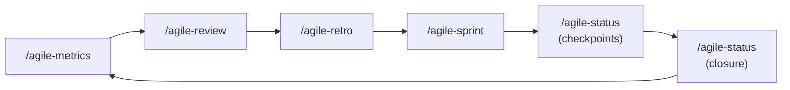

# Sprint Lifecycle

End-to-end scenarios showing how to run Scrum ceremonies from sprint planning through retrospective. Each scenario covers a different team size and maturity level.

**Skills covered:** router, planning, status, review, metrics, retro

---

## Scenario A -- Full sprint cycle (payments team, 2-week sprint)

The payments team (3 devs, 1 tech lead) just finished Sprint 23. Time to close and start Sprint 24.

### Closing Sprint 23

#### 1. Gather metrics

```
/metrics Sprint 23
```

The skill collects data from sprint artifacts:

| Metric | Value |
|--------|-------|
| Stories planned | 5 |
| Stories delivered | 3 (60%) |
| Stories added mid-sprint | 1 (scope creep) |
| Bugs during sprint | 2 |
| Bugs post-delivery | 0 |
| Blockers | 2 (avg duration: 3 days) |
| Avg time per story | 4.2 days |
| Status checkpoints held | 4 of 5 |
| Closure reports | 3 of 5 |

**Trend vs Sprint 22:** Completion rate down (60% vs 80%), blockers up (2 vs 0), scope creep present.

**Highlights for retro:** No post-delivery bugs (positive), but blockers caused 3-day delays and completion rate dropped 20pp.

#### 2. Sprint review

```
/review Sprint 23
```

The skill organizes by business value:

**Deliveries:**
- Stripe provider integration -- delivered as planned
- Webhook event handler -- delivered with scope change (added idempotency)
- Payout reconciliation -- delivered, all acceptance criteria met

**Not delivered:**
- Customer migration -- blocked on migration strategy decision -> returns to backlog
- Legacy decommission -- dependency on migration -> moved to Sprint 24

**Demo:** "The team can now process payments through Stripe end-to-end." Live demo: submit test payment -> webhook fires -> payout reconciled.

**Stakeholder feedback:**
- "Need to discuss migration strategy in next epic decomposition"
- "Can we prioritize customer migration in Sprint 24?"
- "The idempotency addition is a nice touch -- good judgment call"

Save to: `planning/sprints/sprint-23-review.md`

#### 3. Retrospective

```
/retro Sprint 23
```

**Facts (from metrics):**
- 3 of 5 stories delivered (60%)
- 2 blockers averaging 3 days each (infra dependency, API contract change)
- 1 story added mid-sprint (scope creep)

**Perceptions:**
- Team felt context-switching was the biggest drain
- Infra team responsiveness was frustrating

**Analysis:**
- *What worked:* TDD caught a regression early; status checkpoints surfaced blockers within 24h
- *What didn't:* External dependencies caused 3-day average blocker time; no Definition of Ready check before pulling stories
- *Root cause:* Stories with external deps were estimated as self-contained; no DoR gate

**Actions (2 -- focus over quantity):**
1. Add "external dependency check" to DoR -- Owner: tech lead -- Deadline: before Sprint 24 planning
2. Map external dependencies at sprint planning and flag as risks -- Owner: scrum master -- Deadline: Sprint 24 planning

Save to: `planning/retros/retro-sprint-23.md`

---

### Starting Sprint 24

#### 4. Sprint planning

```
/planning Sprint 24
```

The skill reads the epic (5 stories, 1-3 completed), retro actions, and backlog.

**Objective:** "Sprint 24: Deliver customer migration start and complete DoR improvement."

**Backlog review:**

| Item | Size | Dependencies | DoR check |
|------|------|-------------|-----------|
| Customer migration (start) | large | Stripe setup (done) | Objective yes, scope yes, files yes, AC *partial* -- migration strategy still open |
| DoR update: external deps | small | None | Ready |
| Legacy decommission | small | Stories 1-4 | Not ready (depends on migration) |

**DoR validation:**
- Customer migration: *Not fully ready* -- migration strategy undecided. **Decision:** Start the groundwork (schema changes, migration script skeleton) while strategy is confirmed. Full migration in Sprint 25.
- DoR update: Ready.
- Legacy decommission: Not ready -- postponed.

**Selected items:**
1. DoR update (small, quick win, retro action)
2. Customer migration start (large, partial, critical path)

**Capacity:** 8 dev-days (2 devs x 4 working days, accounting for meetings and code review).

**Order:** DoR update first (quick win), then migration start.

Save to: `planning/sprints/sprint-24-planning.md`

---

## Scenario B -- Solo dev weekly cycle

A solo dev works in 1-week cycles on a SaaS product.

### Planning (Monday morning)

```
/planning week of April 14
```

The dev lists 3 items from the backlog:
- Bug: date picker resets on timezone change (small)
- Feature: add CSV export to admin panel (medium)
- Chore: update dependencies (small)

**Capacity:** 5 dev-days.

**Selected:** Bug fix (blocks user complaints) + CSV export. Dependencies update postponed -- not enough capacity.

**Order:** Bug fix first (unblocks complaints), then CSV export.

### Status checkpoints (Tue-Thu)

```
/status
```

Quick inline checkpoints -- no file saved for a solo cycle:
- **Tue:** Bug fix completed. Starting CSV export. No blockers.
- **Wed:** CSV export 60% done. Blocker: admin panel tests are flaky -- need to fix first.
- **Thu:** Flaky tests fixed. CSV export complete. All tests pass.

### Review + retro (Friday)

```
/review week of April 14
```

Lean review: 2 of 2 selected items delivered. Dependency update postponed.

```
/metrics week of April 14
```

Quick metrics: 100% completion, 1 blocker (flaky tests, 0.5 day), no scope creep.

```
/retro week of April 14
```

Lightweight retro:
- *What worked:* Prioritizing the bug fix first was right -- 3 user complaints resolved
- *What didn't:* Flaky tests cost half a day
- *Action:* Add test stability check to the DoR (run tests 3x before marking ready)

---

## Scenario C -- New team starting from zero

A team forms with no sprint history and a raw backlog.

### Finding the right ceremony

```
/router
```

The router asks: "Where are you in the cycle?"

"We don't have a sprint yet. We have a backlog but some items are vague."

**Recommendation:** "Start with `/agile-epic` to decompose and clarify scope, then `/agile-sprint` to define the first sprint."

### First epic decomposition

```
/epic product backlog
```

The epic takes 5 vague items and produces structured story files:
- 2 items were split (large -> 2 medium stories each)
- 1 item was clear enough for a direct task plan (small)
- 2 items needed intake first (too vague -> parked)

### First sprint planning

```
/planning Sprint 1
```

The team selects 3 stories (conservative for first sprint), defines a clear objective, and starts execution.

**Key decision:** First sprint is deliberately under-loaded. Better to deliver 100% of 3 stories than 60% of 5. Velocity data from Sprint 1 calibrates Sprint 2.

---

## Ceremony sequence reference

The typical cycle follows this order:



| Ceremony | When | What it produces | Skill |
|----------|------|-----------------|-------|
| Sprint Metrics | End of sprint, before review | Quantitative data for review and retro | `/agile-metrics` |
| Sprint Review | End of sprint, after metrics | Delivery demo + stakeholder feedback | `/agile-review` |
| Retrospective | After review, before planning | 2-3 improvement actions with owners | `/agile-retro` |
| Sprint Planning | Start of new sprint | Sprint objective + selected items + order | `/agile-sprint` |
| Status (checkpoint) | Every day during sprint | Progress, blockers, next step | `/agile-status` |
| Status (closure) | When a delivery closes | Formal closure with verification | `/agile-status` |

**Not sure which ceremony?** Use `/agile-router` -- it asks where you are in the cycle and points to the right one.

---

## Key takeaways

1. **Metrics before retro:** Ground discussions in data, not impressions
2. **Review shows results, retro discusses process:** Don't mix them
3. **Retro actions need owners and deadlines:** "Improve communication" is not an action
4. **DoR gates prevent mid-sprint surprises:** If it's not ready, it doesn't enter the sprint
5. **First sprint = under-load deliberately:** Build velocity data before committing aggressively
6. **Solo devs benefit too:** Lighter versions of the same ceremonies maintain discipline
