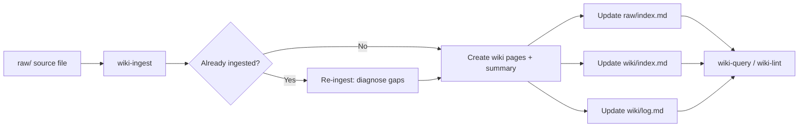

# wiki-ingest

Process a raw source file into structured wiki pages, summaries, and indexes. Transcripts, PDFs, and markdown are read, key points are extracted with human confirmation, and wiki pages are created or updated — all without modifying the original raw files.

## When to use

- A new meeting transcript, document, or reference file needs to be incorporated into the wiki
- An existing source has been updated and the wiki needs to reflect the changes (re-ingest)
- The user says "ingest", "process", "add to wiki", "incorporate this source"

## When NOT to use

- You just want to **ask a question** about existing wiki content → use `wiki-query`
- You want to **audit the wiki** for broken links, orphan pages, or stale content → use `wiki-lint`
- The source is already ingested and unchanged since last ingest — no action needed

## End-to-end examples

### Example 1: Ingesting a meeting transcript

You have a new transcript at `raw/meetings/2025-03-15-sprint-retro.txt` covering a sprint retrospective.

1. **Invoke the skill:** `/wiki-ingest raw/meetings/2025-03-15-sprint-retro.txt`
2. **Check the index:** The skill reads `raw/index.md` — the file is not yet listed, so it proceeds with a fresh ingest.
3. **Read the source:** The skill reads the full transcript. It detects the file covers sprint velocity, blocked stories, and action items.
4. **Present key points to the human:**
   - Sprint velocity dropped 20% due to infra blockers
   - Three stories were blocked by the payment API outage
   - Action item: create an incident response runbook
   - Team agreed to switch from 2-week to 1-week sprints
5. **Human confirms** and asks to emphasize the incident response runbook action item.
6. **Create/update wiki pages:**
   - Update `wiki/ops/sprint-cadence.md` (sprint length change)
   - Update `wiki/data/blocked-stories.md` (payment API blockers)
   - Create `wiki/ops/incident-response-runbook.md` (new page)
7. **Create the source summary** at `wiki/sources/2025-03-15-sprint-retro.md` with frontmatter, key points, and links to the affected wiki pages.
8. **Update indexes:** Mark the source as ✅ ingested in `raw/index.md`, add new entries to `wiki/index.md`, and prepend a log entry to `wiki/log.md`.

### Example 2: Ingesting a PDF policy document

A new data privacy policy PDF arrives at `raw/policies/data-privacy-v2.pdf`.

1. **Invoke the skill:** `/wiki-ingest raw/policies/data-privacy-v2.pdf`
2. **Read the source:** The skill uses `pdf-docling` MCP to convert the PDF to markdown, then reads the result.
3. **Present key points:** The skill identifies changes from v1 — new cookie consent requirements, updated DPO contact, revised data retention periods.
4. **Human confirms** and asks to highlight the new cookie consent rules.
5. **Re-use existing pages:** `wiki/business/data-privacy.md` already exists, so the skill updates it (adds the source to `sources:`, revises content, flags contradictions with v1).
6. **Update the source summary** at `wiki/sources/data-privacy-v2.md`.
7. **Run focused post-ingest lint:** Cross-references in the updated pages are verified. A contradiction is found between the old retention period (90 days) and the new one (60 days) — the skill adds an explicit note in the page.
8. **Update `raw/index.md`, `wiki/index.md`, and `wiki/log.md`.**

### Example 3: Re-ingesting an updated source

A meeting transcript at `raw/meetings/2024-12-10-planning.txt` was already ingested but the file was updated with additional notes.

1. **Invoke the skill:** `/wiki-ingest raw/meetings/2024-12-10-planning.txt`
2. **Check the index:** `raw/index.md` shows this source is already ✅ ingested. The skill finds the existing summary at `wiki/sources/2024-12-10-planning.md`.
3. **Read both the source and the existing summary.** Compare and identify gaps — new information about a scope change for the billing module.
4. **Present a re-ingest diagnosis:**
   ```
   ## Re-ingest: Sprint Planning 2024-12-10
   ### Lacunas identificadas
   - Billing module scope change (API-versioned endpoints) not captured
   ### Páginas que podem ser expandidas
   - wiki/apps/billing-module.md
   ```
5. **Human approves.** The skill updates the billing module page and the source summary.
6. **Update `raw/index.md`, `wiki/index.md`, and `wiki/log.md`.**

## Workflow integration



## Tips & pitfalls

- **Never modify files in `raw/`** — the source of truth stays untouched.
- Process **one source at a time** unless the user explicitly requests batch ingest.
- Always use **complete YAML frontmatter** (title, audience, sources, updated, tags, status) — see `wiki/CONVENTIONS.md`.
- If you find a **contradiction** with existing wiki content, flag it explicitly in the page — don't silently overwrite.
- After ingest, **always update** `raw/index.md`, `wiki/index.md`, and `wiki/log.md` — skipping any of these leaves the wiki in an inconsistent state.
- The post-ingest lint is **focused** (only cross-refs on touched pages). Don't run a full lint — that's what `/wiki-lint` is for.

## Chaining

- **Before:** No prerequisite skill needed, but running `/wiki-lint` first can surface issues that an ingest might resolve.
- **After:** Run `/wiki-query` to verify the ingested content is findable. Run `/wiki-lint` periodically to catch accumulated drift.