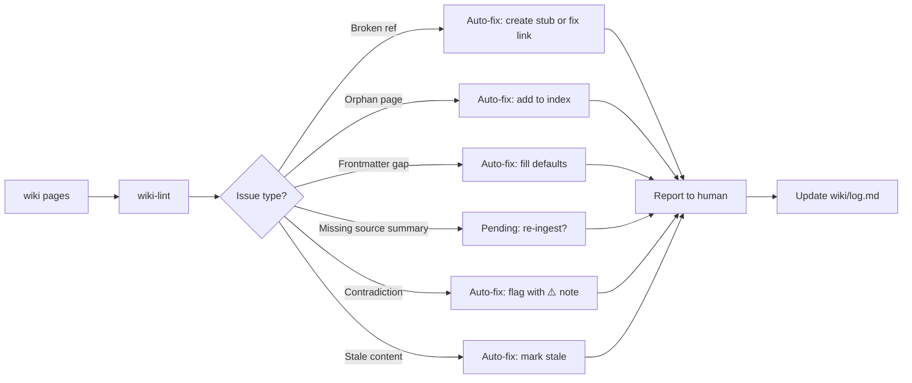

# wiki-lint

Audit and repair the wiki knowledge base for broken links, orphan pages, missing frontmatter, stale content, source inconsistencies, and contradictions. Simple fixes are applied automatically; content decisions are surfaced for human approval.

## When to use

- The wiki feels "messy" and you want a health check
- You've ingested several sources and want to verify consistency
- The user says "audit", "verify", "clean", "organize", "check the wiki"
- Periodically after a series of ingests to catch accumulated drift

## When NOT to use

- You want to **answer a question** from the wiki → use `wiki-query`
- You want to **add new content** → use `wiki-ingest`
- You just did a `/wiki-ingest` and the skill already ran a focused lint on the touched pages — a full lint is unnecessary immediately after

## End-to-end examples

### Example 1: Full wiki health audit

After onboarding three new team members who ingested various documents over a month, the wiki may have drifted.

1. **Invoke the skill:** `/wiki-lint`
2. **Cross-refs broken:** The skill finds `[billing API](./billing-api.md)` in `wiki/apps/checkout.md` but `wiki/apps/billing-api.md` doesn't exist. It creates the stub page and notifies the human.
3. **Orphan pages:** `wiki/data/experimental-flags.md` has no inbound link from `wiki/index.md`. The skill adds it to the index under the "Data" topic table.
4. **Frontmatter check:** `wiki/ops/deployment.md` is missing `tags:` and `status:` fields. The skill fills them in automatically (`tags: [deployment, ops]`, `status: stable`).
5. **Raw ↔ sources consistency:** `raw/index.md` marks `raw/meetings/2025-01-20-all-hands.txt` as ingested, but `wiki/sources/2025-01-20-all-hands.md` doesn't exist. The skill flags this as a pending decision — re-ingest or remove from the index.
6. **Missing cross-refs:** `wiki/business/data-privacy.md` mentions "incident response" but doesn't link to `wiki/ops/incident-response-runbook.md`. The skill suggests adding the link but doesn't do it automatically (could generate noise).
7. **Contradictions:** `wiki/business/data-privacy.md` says 90-day retention; `wiki/ops/data-retention.md` says 60 days. The skill adds a ⚠️ note to both pages.
8. **Stale status:** `wiki/ops/deployment.md` has `status: draft` but the content is complete and validated. Skill changes it to `stable`. `wiki/apps/legacy-import.md` has `updated: 2024-01-10` (over 90 days old) — skill marks it `status: stale`.
9. **Index statistics:** `wiki/index.md` claims 12 pages but there are actually 14. The skill updates the count.
10. **Report to human:**
    - **Pending decisions:** Re-ingest the all-hands meeting or remove from index?
    - **Suggested improvements:** Add cross-ref from data-privacy to incident-response-runbook.
    - **Summary:** 6 problems found, 4 auto-fixed, 2 pending.
11. **Log entry** prepended to `wiki/log.md`:
    ```
    ## [2025-04-11] lint | verificação de saúde

    ### Correções automáticas
    - Created stub wiki/apps/billing-api.md for broken cross-ref
    - Added wiki/data/experimental-flags.md to wiki/index.md
    - Added missing frontmatter (tags, status) to wiki/ops/deployment.md
    - Updated wiki/ops/deployment.md status: draft → stable
    - Marked wiki/apps/legacy-import.md as stale
    - Updated wiki/index.md page count: 12 → 14

    ### Pendentes (decisão humana)
    - wiki/sources/2025-01-20-all-hands.md missing — re-ingest or remove from raw/index.md?
    - Contradiction on data retention (90 vs 60 days) flagged in data-privacy.md and data-retention.md

    ### Sugestões
    - Add cross-ref from data-privacy.md → incident-response-runbook.md
    ```

### Example 2: Focused lint — only cross-refs

After a large ingest, you only want to check that links are intact.

1. **Invoke the skill:** `/wiki-lint só os links` (or ask specifically for cross-ref checks)
2. **Cross-refs broken:** Found 2 broken links — `[API docs](./api-reference.md)` in `wiki/apps/integration.md` and `[schema](./charge-schema.md)` in `wiki/apps/payment-flow.md`.
3. **Auto-fix:** Create stubs for the missing pages.
4. **Report:** "2 broken links found and fixed by creating stub pages."
5. **Log entry** added to `wiki/log.md`.

### Example 3: Lint after re-ingest reveals contradictions

After re-ingesting an updated policy document, contradictions surface.

1. **Invoke the skill:** `/wiki-lint`
2. **Contradictions found:** `wiki/business/data-privacy.md` (updated during re-ingest) says cookies require explicit consent, but `wiki/ops/cookie-banner.md` still says implicit consent is sufficient.
3. **Auto-fix:** Add ⚠️ contradiction notes to both pages, referencing each other.
4. **Pending decision:** Which version is correct? The human needs to confirm and update the outdated page.
5. **Report:** "Contradiction between data-privacy.md and cookie-banner.md on cookie consent — both flagged."
6. **Log entry** added to `wiki/log.md`.

## Workflow integration



## Tips & pitfalls

- **Simple fixes are automatic:** broken links, missing frontmatter fields, stale status flags — the skill fixes these without asking.
- **Content decisions require human approval:** whether to delete an orphan page, which side of a contradiction is correct, whether to add suggested cross-refs (auto-linking every mention creates noise).
- **Don't list every auto-fix** in the response to the human — focus on pending decisions and opportunities. The full detail goes to `wiki/log.md`.
- **Run periodically** after batches of ingests, not after every single ingest (the ingest skill already does a focused lint on touched pages).
- **Focus mode:** If you ask for a specific check (e.g., "just check frontmatter"), the skill skips unrelated checklist items.

## Chaining

- **Before:** Run after a batch of `/wiki-ingest` operations to catch accumulated issues.
- **After:** If lint reveals missing sources → `/wiki-ingest` to add them. If lint reveals gaps in query results → `/wiki-query` to verify findability.