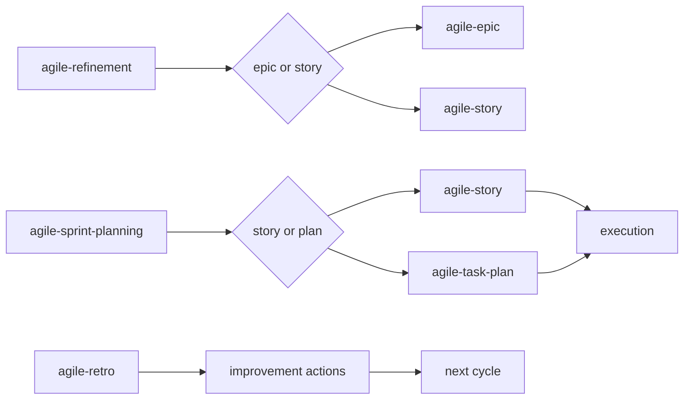

# agile-ceremonies-router

Orchestrates light Scrum ceremonies by routing you to the right ceremony skill — refinement, sprint planning, or retrospective. Use when you know you need a ceremony but aren't sure which one, or when you need guidance on which ceremony fits the current moment in the cycle.

## When to use

- You need a Scrum ceremony but don't know which one
- Starting a new sprint and unsure whether to refine, plan, or both
- A sprint just ended and you need to decide between review, retro, or planning
- Someone asks "which ceremony should we do now?"

## When NOT to use

- You already know which ceremony you need — invoke `/agile-refinement`, `/agile-sprint-planning`, or `/agile-retro` directly
- You need to track ongoing work — use `/agile-daily` or `/agile-delivery` instead
- You need to create an artifact — use the specific skill (intake, story, plan)
- You need metrics — use `/agile-sprint-metrics` instead

## How to use

```
/agile-ceremonies-router
```

Example: `/agile-ceremonies-router`

## End-to-end examples

### Example 1: Sprint ended — what ceremony next?

The sprint just ended and the team lead isn't sure what to do first:

1. Start by invoking: `/agile-ceremonies-router`
2. The skill asks: "Where are you in the cycle? Starting a sprint, mid-sprint with backlog issues, or ending a sprint?"
3. You say: "Sprint just ended."
4. The skill explains the sequence:
   - First: `/agile-sprint-review` — show stakeholders what was delivered
   - Then: `/agile-retro` — reflect on the process and define improvement actions
   - Then: `/agile-sprint-planning` — plan the next sprint with retro improvements integrated
   - (If there are unclear backlog items: `/agile-refinement` should happen before sprint planning)
5. You start with `/agile-sprint-review`.

### Example 2: Mid-sprint with ambiguous backlog items

The team is preparing for the next sprint and some backlog items are unclear:

1. Start by invoking: `/agile-ceremonies-router`
2. The skill asks: "Where are you in the cycle?"
3. You say: "Planning the next sprint, but some backlog items are too vague to estimate."
4. The skill recommends: "You need `/agile-refinement` first to clarify scope, then `/agile-sprint-planning` to select and order items."
5. You run `/agile-refinement` for the ambiguous items, then proceed to `/agile-sprint-planning`.

### Example 3: Starting fresh — no sprint exists

A new team is forming and doesn't have a cycle yet:

1. Start by invoking: `/agile-ceremonies-router`
2. The skill asks: "Where are you in the cycle?"
3. You say: "We don't have a sprint yet. We have a backlog."
4. The skill recommends: "If backlog items are unclear → `/agile-refinement` first. If items are clear → go straight to `/agile-sprint-planning` to define the first sprint."
5. You assess the backlog and pick the right ceremony.

## Ceremony reference

| Ceremony | When to use | Skill | What it produces |
|---|---|---|---|
| Refinement | Clarify scope, break large items, map dependencies | `/agile-refinement` | Story backlog with sizes and dependencies |
| Sprint Planning | Select items, order execution, record capacity | `/agile-sprint-planning` | Sprint plan with objective, items, and order |
| Retrospective | Consolidate learnings, define improvement actions | `/agile-retro` | 2-3 actions with owners and deadlines |

## Workflow integration



## Tips & pitfalls

- This is a router skill — it doesn't produce an artifact. It sends you to the correct ceremony skill.
- If you already know which ceremony you need, skip this and invoke the specific skill directly.
- Every ceremony must produce a clear, reusable artifact (story backlog, sprint plan, or action list). Avoid vague meeting minutes.
- Always convert discussions into verifiable backlog items or actions. "We agreed to improve tests" is not actionable; "Add 'external dependency check' to DoR by Sprint 24" is.
- The typical cycle is: refinement → sprint planning → execution → daily → post-impl → sprint review → retro → repeat.

## Chaining

- **Before:** `/agile-intake` (capture problems), `/agile-epic` (structure backlog)
- **After:** Routes to `/agile-refinement`, `/agile-sprint-planning`, or `/agile-retro` depending on where you are in the cycle.
