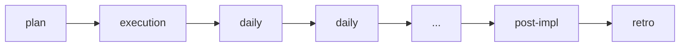

# Daily Delivery

Use this skill to generate a clear, objective, and actionable daily status.

Initial context received via slash: $ARGUMENTS

If `$ARGUMENTS` is filled, use as reference (e.g., initiative name, issue, active plan).
If empty, try to identify the work in progress from conversation context or ask.

## Language

Write the artifact in the user's language. If the user communicates in Portuguese, write in Portuguese with correct grammar and accents. If in English, write in English. When in doubt, ask the user which language to use. Templates are in English — translate headers and content to match.

## Objective

- Record actual progress since the last cycle
- Make blockers explicit with impact, owner, and next action
- Define the next observable step
- Maintain traceability with the plan or issue in progress

## Process

### 1. Identify context

- Which plan, story, or issue is in progress?
- What was the declared next step in the previous daily (if any)?

### 2. Record status

- **In progress:** what is being done now
- **Completed:** what advanced since the last cycle (reference plan tasks)
- **Blockers:** impediments with impact, owner, and next action
- **Risks:** signals that something could delay or change

### 3. Define next step

- Must be observable and verifiable
- Must have clear relation to the active plan

## Where to save

- Present inline by default (the daily is short)
- If the user asks to save: `planning/<initiative>/daily/YYYY-MM-DD.md`

## Chaining

- If there is a critical blocker: suggest escalating or adjusting the plan
- If the delivery is close to closing: suggest `/post-impl`
- If the period needs consolidation: suggest `/status-report`

## Reference template

Use `~/.agents/templates/daily-delivery.md` as base.

## Rules

- The daily must reflect real state, not optimistic intention.
- Blockers must have owner and next action, not just description.
- Next step must be observable ("implement X" is not; "create test for Button fixture" is).
- Keep it short — if it takes more than 5 minutes, the status probably needs a `/status-report`.

## Relationship with the flow

