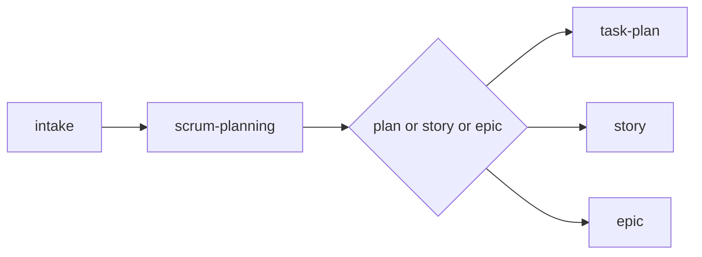

# Scrum Planning (Orchestrator)

Use this skill to decide which planning artifact is appropriate and direct to the correct skill.

Initial context received via slash: $ARGUMENTS

## Objective

- Evaluate the size and clarity of the demand
- Direct to the correct planning skill: `/task-plan`, `/story`, or `/epic`
- Ensure the chosen artifact is proportional to the delivery size

This skill complements the global rules in `~/.agents/rules/methodology.md`, `~/.agents/rules/workflow.md`, and `~/.agents/rules/plans.md`.

## Decision tree

### Use `/task-plan` when

- The change is small and localized — few files, low risk
- The delivery fits in a single implementation cycle
- No complex dependencies or coordination needed

### Use `/story` when
- There is a vertical delivery involving several files with moderate complexity
- There is a richer acceptance criteria
- Validation requires stronger tests and review

### Use `/epic` when
- There are several dependent deliveries requiring coordination across multiple stories
- The initiative needs a roadmap
- Different stories can be planned and executed separately

### Still not clear?
- If the problem is not defined → use `/intake`
- If there is ambiguity about scope → use `/refinement`
- If you need strategic direction → use `/roadmap`

## Light sizing

> **Internal reference for AI agent — not exposed to users.** Use plain language when communicating the recommendation (e.g., "This is a small, localized change — I recommend a simple plan" instead of referencing size codes).

| Size | Description | Artifact | Skill |
|---|---|---|---|
| Extra small | Localized adjustment, 1 file, low risk | Simple plan | `/task-plan` |
| Small | Small delivery, few files, simple validation | Simple plan | `/task-plan` |
| Medium | Vertical delivery, several files, moderate validation | Story | `/story` |
| Large | Large story, needs to be broken down | Epic | `/epic` |
| Extra large | Multi-story initiative, coordination needed | Epic | `/epic` |

## Mandatory rules

Every artifact generated by skills must contain:
1. **Context** (problem, objective, constraints)
2. **Files** (exact paths, action)
3. **Detail** (AS-IS, TO-BE, scope)
4. **Tasks** (verifiable checklist)
5. **Verification** (commands, validations, acceptance)

## Process

1. Evaluate the scope and complexity of the demand internally.
2. If the problem is not clear, suggest `/intake` or `/refinement`.
3. Direct to the correct skill: `/task-plan`, `/story`, or `/epic`.
4. Confirm with the user before proceeding.

## Location convention

- Standalone task plans: `.agents/plans/<name>.md`
- Co-located task plans: `planning/<initiative>/epics/NN-<epic-name>/NN-<story-name>/01-task-plan.md`
- Initiative artifacts: `planning/<initiative>/intake.md`, `roadmap.md`
- Epics: `planning/<initiative>/epics/NN-<epic-name>/epic.md`
- Stories: `planning/<initiative>/epics/NN-<epic-name>/NN-<story-name>/00-story.md`
- Standalone stories: `.agents/plans/<name>.md`

## Relationship with the flow

This skill is a router. It evaluates and directs, but does not produce the final artifact. To produce artifacts, use `/task-plan`, `/story`, or `/epic`.
