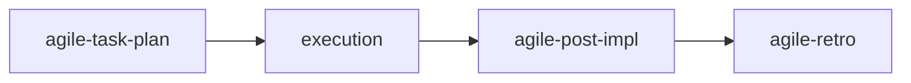

# agile-post-impl

Generates a post-implementation report that formally closes a delivery by comparing what was planned vs. what was delivered, recording verification results, documenting remaining risks, and defining next steps. It's the "close the loop" skill — a delivery isn't done until the post-impl report is written.

## When to use

- A plan, story, or epic has been completed and needs formal closure
- You need to verify and document that all tasks were actually delivered
- Before moving to the next delivery, you want a clear handoff record
- Before a retro, you need an objective record of what happened

## When NOT to use

- Mid-delivery status — use `/agile-daily` or `/agile-status-report` instead
- Tracking ongoing progress — use `/agile-daily` instead
- Planning new work — use `/agile-task-plan` or `/agile-story` instead
- Conducting a retrospective — use `/agile-retro` instead (but post-impl feeds into retro)

## How to use

```
/agile-post-impl
```

Example: `/agile-post-impl auth-refactor-plan`

## End-to-end examples

### Example 1: Closing the rate limiting feature delivery

You just finished implementing rate limiting on the API:

1. Start by invoking: `/agile-post-impl rate-limiting`
2. The skill asks: "Which plan, story, or issue is being closed?"
3. You provide: `.agents/plans/rate-limiting.md`
4. The skill reads the plan and compares tasks against the current state:
   - **Delivered:** Rate limiter middleware added, tests passing, config in place
   - **Pending:** Documentation update (task was in scope but skipped due to time)
   - **Scope change:** Decided to use sliding window instead of fixed window
5. The skill runs verifications: `bun run lint` ✅, `tsc --noEmit` ✅, `bun test` ✅. All pass.
6. It produces the post-impl report with: delivered items, pending items with reason, verification results, remaining risks (need to tune rate limits in prod), next steps (monitor 429 responses, write docs).
7. Save to: `planning/rate-limiting/post-impl.md`
8. The skill suggests: "Next steps are a new story. Want to run `/agile-story`?" or "Cycle ended? Run `/agile-retro`."

### Example 2: Closing a story from an epic

Story "Stripe provider integration" from the payments epic is done:

1. Start by invoking: `/agile-post-impl stripe-provider`
2. The skill reads `planning/payment-system-overhaul/stories/stripe-provider.md`.
3. It compares: all acceptance criteria met, tests pass, lint clean.
4. Produces report: delivered (Stripe integration, webhook handling, test coverage), pending (none), scope change (added idempotency key for safety).
5. Save to: `planning/payment-system-overhaul/post-impl-stripe.md`
6. The skill also notes: "Update story status in the epic to completed."

## Workflow integration



## Tips & pitfalls

- **Always run lint, typecheck, and tests.** Don't assume they pass. Run them and record the actual results.
- Report facts, not intentions. If lint failed, say it failed. If 2 of 5 tasks are pending, document them.
- If tasks were left pending, explain why — not just "didn't finish."
- The report must allow another person to understand the delivery state without additional context.
- Always update the epic's story status (if applicable) after closing.

## Chaining

- **Before:** `/agile-task-plan` or `/agile-story` (the plan/story being closed), `/agile-daily` (tracking during execution)
- **After:** If next steps become new stories → `/agile-story` or `/agile-task-plan`. If the cycle ended → `/agile-retro`. If part of an epic → update story status in the epic.
