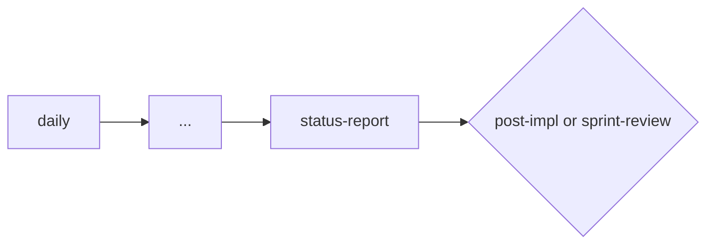

# Status Report

Use this skill to consolidate the progress of a period or milestone into an objective report.

Initial context received via slash: $ARGUMENTS

If `$ARGUMENTS` is filled, use as reference (e.g., initiative, period, epic).
If empty, ask which period or initiative will be consolidated.

## Objective

- Consolidate deliveries, deviations, and risks from a period
- Clearly distinguish completed, in progress, and at risk
- Record necessary decisions and next steps
- Maintain traceability with the epic, roadmap, or sprint

## Process

### 1. Define report scope

- Which period or milestone?
- Which initiative, epic, or sprint?

### 2. Collect data

Consult:
- Dailies from the period (if they exist)
- Active plans and their checklists
- Epic/stories and task statuses
- Git log for progress evidence

### 3. Consolidate

- **Completed:** deliveries finalized in the period
- **In progress:** what is in progress with expectation
- **Deviations:** what changed in scope, was delayed, or was cut
- **Risks and blockers:** what could impact the next period
- **Necessary decisions:** what needs alignment

### 4. Next steps

- What will be done in the next period
- Who is responsible for each action

## Where to save

- `planning/<initiative>/status-report-YYYY-MM-DD.md`
- Or present inline if it's a short report

## Chaining

- If the period closed a delivery: suggest `/post-impl`
- If the sprint ended: suggest `/sprint-review` or `/retro`
- If there are pending decisions: highlight for the user

## Reference template

Use `~/.agents/templates/status-report.md` as base.

## Rules

- The report must be honest. Don't hide deviations or delays.
- Distinguish facts from expectations ("was delivered" vs "should be delivered").
- Blockers must have owner and next action.
- Keep it proportional — 1-week report doesn't need 5 pages.

## Relationship with the flow

