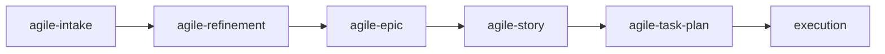

# agile-story

Details a medium-sized vertical delivery with clear acceptance criteria, task breakdown, file mapping, and verification strategy. Use when the work involves several files, needs richer acceptance criteria than a simple plan, and must be executable without additional inference — every story should be self-contained enough that anyone can implement it.

## When to use

- Medium-sized work — several files, moderate validation needed
- A vertical delivery that needs richer acceptance criteria
- A story from an epic that needs to be detailed before execution
- A bug fix with regression risk that needs structured verification
- You need acceptance criteria that are specific, observable, and independent

## When NOT to use

- Small and localized work — use `/agile-task-plan` instead
- Multi-story initiatives needing coordination — use `/agile-epic` first
- The problem hasn't been analyzed yet — use `/agile-intake` or `/agile-refinement` first
- You just need a quick tracking update — use `/agile-daily`

## How to use

```
/agile-story
```

Example: `/agile-story user-login-flow`

## End-to-end examples

### Example 1: Detailing a story from the payments epic

The payments epic has a story "Webhook event handler" that needs detail before implementation:

1. Start by invoking: `/agile-story webhook event handler`
2. The skill reads `planning/payment-system-overhaul/epic.md` and identifies: Story 2, depends on Story 1 (Stripe provider integration), objective is to process Stripe webhook events and update order status.

   **Step 1 — Understand context:**
   - Story within epic: "Webhook event handler"
   - Dependency: Story 1 completed (Stripe provider integration)
   - Constraint: Must be idempotent (duplicate events must not cause double processing)

   **Step 2 — Map scope:**
   - In scope: Receive webhooks, verify signatures, parse events, update order status, respond 200
   - Out of scope: Retry logic (separate story), admin dashboard for webhooks
   - Files:
     - `src/webhooks/stripe-webhook.ts` — create
     - `src/webhooks/verify-signature.ts` — create
     - `src/orders/update-status.ts` — alter
     - `src/__tests__/webhooks/stripe-webhook.test.ts` — create
     - `src/webhooks/routes.ts` — alter

   **Step 3 — Define acceptance criteria:**
   - AC1: Receives `payment_intent.succeeded` event and updates order status to "paid"
   - AC2: Receives `payment_intent.payment_failed` event and updates order status to "failed"
   - AC3: Duplicate webhook with same event ID returns 200 without side effects (idempotency)
   - AC4: Invalid signature returns 401
   - AC5: Responses within 500ms for P95

   **Step 4 — Detail tasks:**
   - [ ] Create `verify-signature.ts` with Stripe webhook signature validation
   - [ ] Create `stripe-webhook.ts` with event type router
   - [ ] Update `update-status.ts` to handle payment status transitions
   - [ ] Add idempotency check using event ID
   - [ ] Write unit tests for all acceptance criteria
   - [ ] Add webhook route to `routes.ts`
   - [ ] Run lint, typecheck, tests
   - [ ] Verify in staging with Stripe CLI

   **Step 5 — Define verification:**
   - `bun run lint` must pass
   - `tsc --noEmit` must pass
   - `bun test` must pass (including idempotency test)
   - Manual: Send test webhook via Stripe CLI, verify order status updates

3. Save to: `planning/payment-system-overhaul/stories/webhook-event-handler.md`
4. The skill offers: "Do you want to create the execution plan with `/agile-task-plan`?"

### Example 2: Standalone story for a notification system

The team wants a notification system for order status changes:

1. Start by invoking: `/agile-story order status notifications`
2. The skill asks for context (no epic reference).
3. You provide: "When an order status changes, send an email notification to the customer."
4. The skill maps files, defines acceptance criteria, creates tasks in vertical slices (not horizontal), and defines verification.
5. Save to: `.agents/plans/order-status-notifications.md`

## Workflow integration



## Tips & pitfalls

- Never create a story without context. If the problem isn't clear, use `/agile-intake` first.
- Acceptance criteria must be verifiable. "It must work" is not acceptance. "Receiving `payment_intent.succeeded` updates order status to 'paid'" is.
- Files must have exact paths, not vague areas like "the auth module." Explore the codebase first.
- Tasks must be vertical (end-to-end), not horizontal. "Add webhook route → verify signature → update order status" is vertical. "All backend changes, then all frontend changes" is horizontal.
- The story must be executable without needing additional information. If you find gaps, go back and fill them.

## Chaining

- **Before:** `/agile-intake` (capture problem), `/agile-epic` (structure backlog), `/agile-refinement` (decompose)
- **After:** `/agile-task-plan` (create execution plan), `/agile-scan-review` (review code before commit), `/agile-post-impl` (close delivery)
