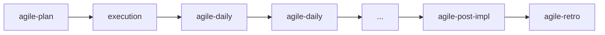

# agile-daily

Generates a concise, objective daily status update showing what advanced, what's blocked, and what the next observable step is. It replaces ad-hoc status updates with a structured format that keeps the team aligned on real progress instead of optimistic intentions.

## When to use

- You need a quick daily status of current work (progress, blockers, next step)
- Starting a work session and want to record what happened since the last cycle
- A blocker surfaced and needs to be made explicit with owner and action
- You're midway through a plan and need a checkpoint

## When NOT to use

- You need to consolidate a full period or milestone — use `/agile-status-report` instead
- A delivery just finished and needs formal closure — use `/agile-post-impl` instead
- You need to plan a sprint — use `/agile-sprint-planning` instead

## How to use

```
/agile-daily
```

Example: `/agile-daily auth-refactor`

## End-to-end examples

### Example 1: Daily status during JWT auth implementation

You're mid-sprint implementing JWT authentication for the API:

1. Start by invoking: `/agile-daily jwt-auth`
2. The skill asks: "What plan, story, or issue is in progress? What was the declared next step from the previous daily?"
3. You provide: "Working on `planning/jwt-auth/stories/auth-middleware.md`. Yesterday's next step was 'create test suite for token validation'."
4. The skill reads the plan, identifies completed tasks, and asks about blockers.
5. You mention: "Blocked on OAuth provider token revocation endpoint — waiting on infra team."
6. The skill produces a daily status with: completed items (`[x]` tasks from the plan), blocker (depended endpoint, owner: infra team, next action: sync meeting tomorrow), next step (implement refresh token rotation).
7. Save to: `planning/jwt-auth/daily/2026-04-11.md`

### Example 2: Quick inline daily for a standalone plan

You're working on a small bug fix and want a checkpoint:

1. Start by invoking: `/agile-daily`
2. The skill asks: "Which plan or story is in progress?"
3. You say: "The password reset flow bug fix, `.agents/plans/password-reset-bug.md`."
4. The skill reads the plan, sees you've checked off 2 of 4 tasks.
5. It produces: completed (reset token expiry logic, added unit tests), in progress (email template update), blockers (none), next step (verify email renders correctly in staging).
6. Presented inline (no file saved — short daily).

## Workflow integration



## Tips & pitfalls

- Keep the daily under 5 minutes. If it takes longer, you likely need a `/agile-status-report` instead.
- Blockers must have an owner and a next action — "blocked on X" without saying who resolves it and when is useless.
- Next steps must be observable and verifiable. "Implement feature X" is not observable; "Create test for Button fixture" is.
- Always reference the specific plan, story, or issue. A daily without context is a daily without traceability.

## Chaining

- **Before:** `/agile-plan` or `/agile-story` (the daily tracks progress against a plan or story)
- **After:** If a critical blocker exists — escalate or adjust the plan. If the delivery is closing — `/agile-post-impl`. If the period needs consolidation — `/agile-status-report`.
