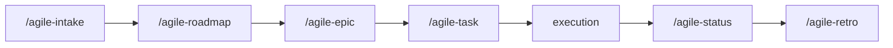

# Epic

Use this skill to transform an intake, roadmap, or large initiative into a structured epic with decomposed stories, a roadmap, and acceptance criteria.

Initial context received via slash: $ARGUMENTS

If `$ARGUMENTS` is filled (e.g., intake path, description, initiative name), use as starting point.
If empty, ask which initiative will be structured.

## Language

Write the artifact in the user's language. If the user communicates in Portuguese, write in Portuguese with correct grammar and accents. If in English, write in English. When in doubt, ask the user which language to use. Templates are in English — translate headers and content to match.

## Objective

- Decompose large initiatives into proportional, executable stories
- Structure a story backlog with dependencies and order
- Define an epic roadmap (phases, unblocks, intermediate validations)
- Ensure each story can be planned and executed separately
- Produce artifacts that guide execution without replacing individual task plans

## When to use

- After an `/agile-intake` or `/agile-roadmap` identified a large initiative
- When the initiative requires multiple coordinated stories
- When there are dependencies between deliveries that need sequencing
- When a roadmap is needed to guide the delivery order
- For medium-to-large work that needs richer structure than a simple `/agile-task`

## When NOT to use

- The work is small and localized — use `/agile-task` directly
- The problem hasn't been captured yet — use `/agile-intake` first
- You need strategic direction — use `/agile-roadmap` first
- You need to validate existing artifacts — use `/agile-refinement`

## Process

### 1. Analyze context

Read the intake, roadmap, or provided material. Identify:

- Macro problem and objective
- Which areas are impacted
- Constraints and premises
- Estimated scope and complexity

### 2. Decompose into stories

Break by **vertical value slice**, not by technical layer:

- Each story must deliver something observable
- Prefer independent stories when possible
- Identify dependencies between stories (what unblocks what)

For each story, define:

- Name and objective (1 line)
- Estimated scope (small, medium, or large)
- Dependencies (which stories it depends on)
- Summarized acceptance criteria

### 3. Structure the epic overview

Fill in the required sections:

- **Context:** problem, AS-IS, TO-BE, out of scope
- **Story backlog:** list with objective, size, and dependency of each
- **Roadmap:** phases/sprints, what unblocks what, intermediate validations
- **Risks:** what could go wrong and how to mitigate
- **Epic acceptance criteria:** how to know the initiative is complete

### 4. Define roadmap

- Group stories by phase/sprint
- Show what can run in parallel
- Highlight the critical path
- Include intermediate validations (milestones)

### 5. Consider collaborative work

When the team has 2+ developers:
- Identify parallel tracks or lanes so devs can work simultaneously
- Define interface contracts between tracks (types, schemas, APIs) to minimize blocking
- Assign stories to tracks when possible
- Use Mermaid `gantt` diagrams to visualize parallel work across tracks

### 6. Generate files

The epic produces multiple files:

```
planning/<initiative>/epics/NN-<epic-name>/
├── 00-overview.md         (the epic overview: context, backlog, roadmap, risks)
├── 01-story-name.md       (first story: context + tasks inline)
├── 02-story-name.md       (second story: context + tasks inline)
└── ...
```

- `00-overview.md` contains the epic-level context, story backlog summary, roadmap, risks, and acceptance criteria.
- Each `NN-story-name.md` contains the story context, acceptance criteria, files, tasks, and verification — all in one file.

> NN is a zero-padded sequential number. Each epic gets its own folder under `epics/`.

## Where to save

- Epic folder: `planning/<initiative>/epics/NN-<epic-name>/`
- If the initiative doesn't have a folder in `planning/`, ask the user for the name

## Cross-reference

Always include at the top of `00-overview.md`:

```
**Origin:** `planning/<initiative>/intake.md`
```

Each story file includes:

```
**Origin:** `planning/<initiative>/epics/NN-<epic-name>/00-overview.md`
```

## Chaining

At the end of the epic, offer:

- "Do you want me to create the execution plan for Story 1 with `/agile-task`?"
- "Do you want me to validate the artifacts with `/agile-refinement`?"

Ask the user which story they want to detail first.

## Reference template

Use `~/.agents/templates/epic.md` as base for the overview artifact.

## Rules

- The epic now handles decomposition directly — there is no separate refinement step for decomposing. Use `/agile-refinement` only for validation/lint.
- Break by behavior/delivery (vertical slices), not by technical layer.
- Each story in the backlog must have a clear objective and be executable separately.
- The roadmap must show dependencies, not just chronological order.
- Epic acceptance criteria must be verifiable.
- Update story statuses as the epic progresses.
- Each story file must contain enough context to be planned and executed independently.

## Required sections for 00-overview.md

1. **Context** (problem, AS-IS, TO-BE, out of scope)
2. **Story backlog** (list with objective, size, dependency, status)
3. **Roadmap** (phases, parallelism, critical path)
4. **Epic acceptance criteria**
5. **Risks**

## Required sections for NN-story-name.md

1. **Context** (problem, objective, value, constraints)
2. **Files** (exact paths, action, reason)
3. **Detail** (AS-IS, TO-BE, scope, acceptance criteria, dependencies)
4. **Tasks** (verifiable checklist in vertical phases)
5. **Verification** (commands, validations, evidence)

## Relationship with the flow



This skill acts after intake/roadmap and before task-level execution. For validating artifacts, use `/agile-refinement`. For execution plans, use `/agile-task`.
