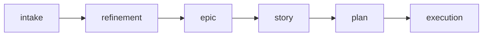

# Epic

Use this skill to transform a refinement or large initiative into a structured epic with story backlog, roadmap, and acceptance criteria.

Initial context received via slash: $ARGUMENTS

If `$ARGUMENTS` is filled (e.g., refinement path, intake, or description), use as starting point.
If empty, ask which initiative will be structured.

## Objective

- Structure story backlog with dependencies and order
- Define epic roadmap (phases, unblocks, intermediate validations)
- Ensure each story can be planned and executed separately
- Produce artifact that guides execution without replacing individual plans

## When to use

- After a `/refinement` that generated several stories
- When the initiative has size L or XL
- When there are dependencies between deliveries that need coordination
- When a roadmap is needed to guide the sequence

## When NOT to use

- The work fits in a single story — use `/story`
- The work is localized and small — use `/plan`
- The problem hasn't been analyzed yet — use `/intake` or `/refinement` first

## Process

### 1. Analyze context

Read the refinement, intake, or provided material. Identify:

- Macro problem and objective
- Stories already identified (from refinement)
- Constraints and premises

### 2. Structure the epic

Fill in the required sections:

- **Context:** problem, AS-IS, TO-BE, out of scope
- **Story backlog:** list with objective, size, and dependency of each
- **Roadmap:** phases/sprints, what unblocks what, intermediate validations
- **Risks:** what could go wrong and how to mitigate
- **Epic acceptance criteria:** how to know the initiative is complete

### 3. Detail each story (summary)

For each story in the backlog, register:

- Name and objective (1 line)
- Estimated size (XS to XL)
- Depends on (which stories)
- Status (not started, in progress, completed)

The full detail of each story will be done with `/story`.

### 4. Define roadmap

- Group stories by phase/sprint
- Show what can run in parallel
- Highlight the critical path
- Include intermediate validations (milestones)

## Where to save

- Save at `planning/<initiative>/epic.md`
- If the initiative doesn't have a folder in `planning/`, ask the user for the name

## Cross-reference

Always include at the top of the artifact:

```
**Origin:** `planning/<initiative>/intake.md`
**Refinement:** `planning/<initiative>/refinement.md`
```

## Chaining

At the end of the epic, offer:

- "Do you want me to detail a story with `/story`?"
- "Do you want to start with Story 1 using `/plan`?"

Ask the user which story they want to detail first.

## Reference template

Use `~/.agents/templates/epic.md` as base for the artifact.

## Rules

- The epic does not replace stories or plans. It organizes the backlog and guides the sequence.
- Each story in the backlog must have a clear objective and be executable separately.
- The roadmap must show dependencies, not just chronological order.
- Epic acceptance criteria must be verifiable.
- Update story statuses as the epic progresses.

## Required sections

Every epic must contain:

1. **Context** (problem, AS-IS, TO-BE, out of scope)
2. **Story backlog** (list with objective, size, dependency, status)
3. **Roadmap** (phases, parallelism, critical path)
4. **Epic acceptance criteria**
5. **Risks**

## Relationship with the flow



This skill acts after refinement and before detailing individual stories. For refinement, use `/refinement`. For detailing a story, use `/story`.
