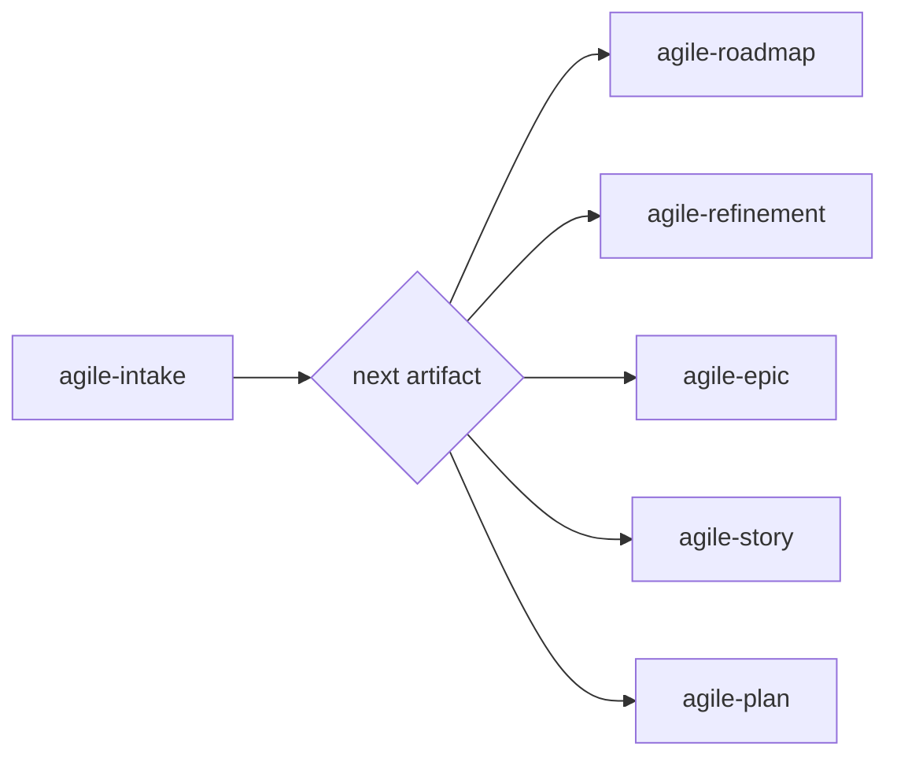

# agile-intake

Transforms vague problems, initial ideas, or unstructured requests into clear intake documents that define the problem, constraints, and the next step in the flow. It's the entry point of the agile pipeline — before anything gets planned or estimated, it needs to be captured.

## When to use

- Someone brings an idea, need, or problem without defined scope
- A request is too vague to become a story or plan directly
- There's uncertainty about size, priority, or approach
- It's the first contact with a new problem or initiative
- You need to decide what the next artifact should be (roadmap, refinement, story, or plan)

## When NOT to use

- The problem is already clear with defined scope — use `/agile-story` or `/agile-plan` directly
- The work has already been refined with stories identified — use `/agile-epic` or `/agile-story`
- It's a trivial fix (rename a variable, fix a typo) — use `/agile-plan` directly
- You need to track delivery progress — use `/agile-daily` or `/agile-status-report`

## How to use

```
/agile-intake
```

Example: `/agile-intake component-tests`

## End-to-end examples

### Example 1: New feature request from product

Product asks "we need SSO for enterprise customers" with no further details:

1. Start by invoking: `/agile-intake SSO for enterprise customers`
2. The skill asks clarifying questions:
   - What problem does SSO solve? — "Enterprise customers won't sign up without it; we're losing deals."
   - Who is affected? — "B2B customers and the sales team."
   - Is there urgency? — "Yes, 3 enterprise deals are blocked on this."
   - What constraints are known? — "Must support SAML 2.0 and OIDC. No custom auth protocols."
3. The skill structures the intake: context (problem: losing enterprise deals; objective: SSO integration; value signal: unblock 3 deals worth $200K), initial scope (SAML + OIDC only, no social login), open questions (which IdPs? audit requirements? migration path for existing users?).
4. The skill recommends: "This is a large, strategic problem → `/agile-roadmap` to plan the quarters, then `/agile-refinement` to break it down."
5. Save to: `planning/sso-enterprise/intake.md`
6. You confirm and the skill offers: "Do you want me to run `/agile-roadmap` for this initiative?"

### Example 2: Bug report that turns out to be a larger issue

A dev reports "the export feature is slow and sometimes times out":

1. Start by invoking: `/agile-intake export performance issue`
2. The skill asks: "What's the problem? Who's affected? Any deadlines? Known constraints?"
3. You provide: "Export times out for datasets > 50K rows. Affects all pro-tier users. Needs fix before Q2 demo."
4. The skill structures: context (problem: export timeout on large datasets; objective: reliable export under 30s for any size; constraints: must work for existing data), open questions (are we optimizing or rewriting? what's the current architecture?).
5. The skill recommends: "This is a medium-sized problem with reasonable scope → `/agile-story` to detail it."
6. Save to: `planning/export-perf/intake.md`

### Example 3: Quick intake for a small improvement

A designer asks "can we add dark mode to the settings page?":

1. Start by invoking: `/agile-intake dark mode settings page`
2. The skill asks clarifying questions. The answers are straightforward — it's a small, clear UX change.
3. The skill recommends: "This is small and clear → `/agile-plan` directly. No need for refinement or story."
4. Presented inline (no file saved — too small for a folder).

## Workflow integration



## Tips & pitfalls

- Never jump straight to implementation from an intake. The intake generates the next artifact, not code.
- Keep the intake conversation to 10-15 minutes max. If it takes longer, the problem probably needs `/agile-refinement`.
- Don't assume answers. If the user doesn't know, register it as an open question.
- If the user insists on starting without clarity, register the risks explicitly and ask if they want to proceed anyway.

## Chaining

- **Before:** Nothing — intake is the entry point.
- **After:** Routes to `/agile-roadmap` (large/strategic), `/agile-refinement` (large/operational), `/agile-epic` (already refined), `/agile-story` (medium/clear), or `/agile-plan` (small/obvious).
