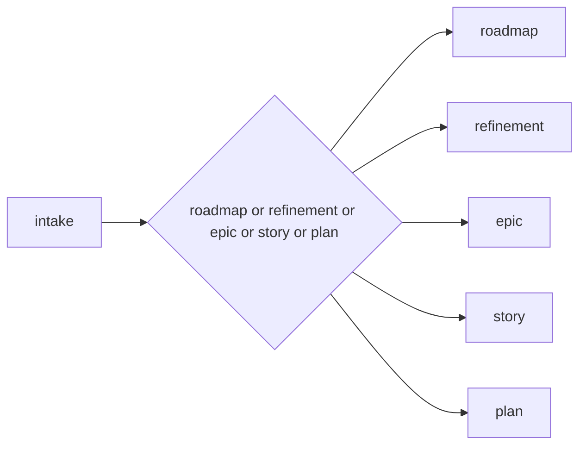

# Intake

Use this skill to transform vague problems, initial ideas, or unstructured requests into clear, actionable intake documents.

Initial context received via slash: $ARGUMENTS

If `$ARGUMENTS` is filled (e.g., file path, text, issue reference, URL), use as starting point for the intake.
If empty, start by asking for a short description of the problem.

## Language

Write the artifact in the user's language. If the user communicates in Portuguese, write in Portuguese with correct grammar and accents. If in English, write in English. When in doubt, ask the user which language to use. Templates are in English — translate headers and content to match.

## Objective

- Make the problem or opportunity explicit before planning
- Identify constraints, premises, and open questions
- Define the next step in the flow: `/roadmap`, `/refinement`, `/story`, or `/plan`
- Avoid work starting without clarity about what is being solved

## When to use

- Someone brings an idea, need, or problem without defined scope
- The request is too vague to become a story or plan directly
- There is uncertainty about size, priority, or approach
- It is the first contact with a new problem

## When NOT to use

- The problem is already clear and scope is defined — use `/story` or `/plan` directly
- The work has already been refined — go to `/story` or `/plan`
- It's a trivial fix — use `/plan` directly

## Intake process

### 1. Listen and record

Ask the user:

- What is the problem or opportunity?
- Who is affected and how?
- Is there urgency or deadline?
- What constraints are already known?

Don't assume answers. If the user doesn't know, register as an open question.

### 2. Structure the intake

Fill in the template with collected information:

- Context: problem, initial objective, value signal, constraints
- Initial scope: what is included and what is not (even if provisional)
- Inputs and references: stakeholders, documents, technical context
- Open questions: everything that doesn't have an answer yet

### 3. Define next step

Based on size and clarity:

- Large and strategic problem → `/roadmap` → then `/refinement`
- Large but operational problem with broad scope → `/refinement`
- Medium problem with reasonable scope → `/refinement` (or `/story` if already well-decomposed)
- Small and clear problem → `/plan`

Register the recommendation in the intake and confirm with the user.

> **Flow rule:** For large or complex items, refinement is mandatory before creating epics or stories. Only small, localized items can skip directly to `/plan`.

### 4. Save the intake

- Ask for the initiative name (e.g., "component-tests", "auth-refactor")
- Save at `planning/<initiative>/intake.md`
- If the user prefers not to save, present inline

### 5. Chain

After user confirmation, offer to generate the next artifact following the official flow:

- Large/strategic → "Do you want me to create the `/roadmap`?"
- Large/operational → "Do you want me to run `/refinement` to decompose into stories?"
- Small/clear → "Do you want me to create the `/plan`?"

> **Never offer `/epic` or `/story` directly from intake for large or complex items.** These must pass through `/refinement` first to ensure proper decomposition.

### 6. Validate

Before closing the intake, confirm:

- [ ] The problem is clear enough for the next step
- [ ] Constraints and premises have been made explicit
- [ ] The next artifact in the flow has been defined

## Rules

- Never jump straight to implementation from an intake. The intake generates the next artifact, not code.
- If the user insists on starting without clarity, register the risks and ask if they want to proceed anyway.
- The intake should be short — 10 to 15 minutes of conversation maximum. If it takes longer, the problem probably needs `/refinement`.
- Keep the tone of discovery, not detailed planning.

## Template

Use `~/.agents/templates/intake.md` as base for the artifact.

## Relationship with the flow

This skill is the entry point of the flow. It captures the problem and directs to the correct skill. For decision between artifacts, you can also use `/scrum-planning`. For ceremonies, use `/scrum-ceremonies`.
