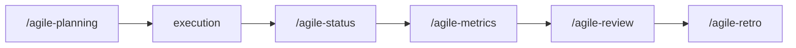

# agile-metrics

Consolidates objective, quantitative metrics from sprint artifacts -- delivery rate, quality indicators, flow metrics, and process adherence. Use before a retro or sprint review to ground discussions in data instead of impressions, and to identify trends across sprints.

## When to use

- At the end of a sprint, before the sprint review or retro
- The team needs data to discuss performance (instead of gut feelings)
- Comparing sprints to identify trends (improving, degrading, stable)
- Doubts about whether declared capacity is calibrated correctly
- Feeding quantitative data into `/agile-retro` or `/agile-review`

## When NOT to use

- During the sprint for status updates -- use `/agile-status` instead
- Closing a specific delivery -- use `/agile-status` (closure mode) instead
- Planning the next sprint -- use `/agile-planning` instead (though metrics feed into it)
- Qualitative reflection -- use `/agile-retro` instead (but metrics provide the data for it)

## How to use

```
/agile-metrics
```

Example: `/agile-metrics sprint-12`

## End-to-end examples

### Example 1: Sprint 23 metrics for the payments team

The sprint just ended and the retro is tomorrow:

1. Start by invoking: `/agile-metrics Sprint 23`
2. The skill collects data from sprint planning, issues, status checkpoints, and closure reports.
3. It calculates delivery rate, quality, flow, and process metrics.
4. Compares against previous sprints for trends.
5. Produces highlights for the retro.

### Example 2: Quarterly trend analysis

After 6 sprints, the team wants to see if velocity is improving:

1. Start by invoking: `/agile-metrics Q1 2026`
2. The skill collects data from multiple sprints and calculates trends.

## Workflow integration



## Tips & pitfalls

- Metrics are reflection tools, not judgment tools. The goal is to improve the process, not evaluate people.
- Never manipulate numbers. If the sprint was bad, the numbers should show it.
- Compare sprints carefully. Different contexts invalidate direct comparisons.
- Metrics without discussion are useless. Always present within a retro or review.
- Don't round numbers to look better. Precision matters.

## Chaining

- **Before:** Sprint planning, status checkpoints, closure reports (these are the data sources)
- **After:** Feeds into `/agile-review` (show what was delivered), `/agile-retro` (discuss what to improve), and `/agile-planning` (calibrate capacity).
