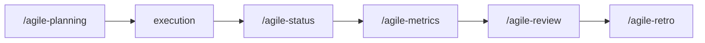

# Sprint Metrics

Use this skill to extract objective metrics from sprint artifacts and generate a quantitative summary.

## Language

Write the artifact in the user's language. If the user communicates in Portuguese, write in Portuguese with correct grammar and accents. If in English, write in English. When in doubt, ask the user which language to use. Templates are in English — translate headers and content to match.

## Objective

- Consolidate sprint data into concrete numbers
- Feed retro and sprint review with facts, not impressions
- Identify patterns between sprints (improvement or degradation)
- Support capacity and planning decisions

## When to use

- At the end of the sprint, before review or retro
- When the team needs data to discuss performance
- To compare sprints and identify trends
- When there is doubt if declared capacity is calibrated

## Collected metrics

### Delivery
- Total planned stories/items
- Total delivered vs not delivered
- Completion rate (%)
- Items added during the sprint (scope creep)
- Items removed or postponed

### Quality
- Bugs found during the sprint
- Bugs found after delivery
- Test coverage (if measurable)
- Lint, typecheck, or test failures at closing

### Flow
- Registered blockers (quantity and average duration)
- Average time between story start and completion
- Stories that returned from "done" to "in progress"

### Process
- Status checkpoints held vs expected
- Status closure reports generated
- Issues opened vs closed

## Process

### 1. Collect data

Consult sprint artifacts:
- Sprint planning (committed items)
- Issues (opened, closed, blocked)
- Status checkpoints (blockers, progress)
- Status closure reports (executed verifications)
- Commits and PRs (volume of changes)

### 2. Calculate metrics

Fill the template with real numbers. Don't round to look better — precision matters more than appearance.

### 3. Analyze trends

If there is data from previous sprints, compare:
- Is the completion rate improving?
- Are blockers decreasing?
- Is scope creep under control?

### 4. Generate summary

The summary must be short enough to read in 2 minutes.

## Template

```markdown
# Sprint Metrics: <Sprint>

## Context
- Project/team:
- Period:
- Declared capacity:

## Delivery
- Planned: X items
- Delivered: Y items (Z%)
- Added during sprint: W items
- Removed/postponed: V items

## Quality
- Bugs during sprint: N
- Bugs post-delivery: N
- Lint/typecheck/tests: passed / failed (detail)

## Flow
- Blockers: N (average duration: X days)
- Average time per story: X days
- Reopenings: N stories

## Process
- Status checkpoints: X of Y expected
- Closure reports: X of Y deliveries
- Issues closed: X of Y

## Trend vs previous sprint
- Completion rate: up/down/stable (X% vs Y%)
- Blockers: more/less/same
- Scope creep: more/less/same

## Highlights for retro
- Positive point:
- Attention point:
- Action suggestion:
```

## Rules

- Metrics are reflection tools, not judgment tools. The goal is to improve the process, not evaluate people.
- Never manipulate numbers to look better. If the sprint was bad, the numbers should reflect that — and the retro should discuss why.
- Compare sprints carefully. Different contexts (vacations, external blockers, team changes) invalidate direct comparisons.
- Metrics without discussion are useless. Always present within a retro or review, never as an autonomous report.

## Relationship with the flow



Sprint metrics feeds `/agile-review` and `/agile-retro`. Use `/agile-status` for tracking during the sprint.
