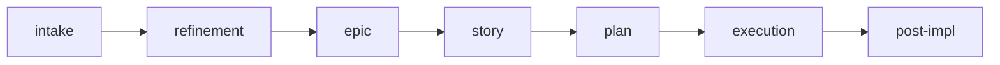

# Plan

Use this skill to create a simple execution plan, ready to implement.

Initial context received via slash: $ARGUMENTS

If `$ARGUMENTS` is filled (e.g., story reference, description, issue), use as starting point.
If empty, ask what will be planned.

## Language

Write the artifact in the user's language. If the user communicates in Portuguese, write in Portuguese with correct grammar and accents. If in English, write in English. When in doubt, ask the user which language to use. Templates are in English — translate headers and content to match.

## Objective

- Create a clear and proportionally simple execution plan
- Map impacted files
- Define verifiable tasks
- Produce artifact ready for immediate implementation

## When to use

- Small and localized work — few files, low risk, single-cycle delivery
- Few impacted files
- Can be executed in a single cycle
- Story already detailed that needs an operational plan

## When NOT to use

- Medium or large work — use `/story` or `/epic`
- Problem not yet clear — use `/intake`
- Multiple dependent deliveries — use `/epic`

## Process

### 1. Understand what will be done

If coming from a story, read the story and extract:
- Objective
- Impacted files
- Acceptance criteria

If standalone, ask the user and explore the code to understand context.

### 2. Build the plan

Fill in the required sections:

- **Context:** problem, objective, constraints
- **Files:** exact paths with action (read/alter/create)
- **Detail:** AS-IS, TO-BE, scope, approach
- **Tasks:** verifiable checklist
- **Verification:** commands and validations

### 3. Present and wait for confirmation

Use ExitPlanMode to present the plan. Wait for explicit confirmation before implementing.

## Where to save

- Save at `.agents/plans/<name>.md`
- If part of an initiative and the story is in `planning/`: reference the story in context

> Plans are execution artifacts. They reference their parent story via the Origin field but are stored separately in `.agents/plans/` for AI agent consumption.

## Cross-reference

If the plan comes from a story or epic, include at the top:

```
**Origin:** `planning/<initiative>/epics/NN-<epic-name>/stories/NN-<story-name>.md` or `planning/<initiative>/epics/NN-<epic-name>/epic.md`
```

## Chaining

After plan confirmation:
- Implement following the checklist
- At the end, suggest `/post-impl` to close the delivery

## Reference template

Use `~/.agents/templates/plan.md` as base.

## Required sections

Every plan must contain:

1. **Context** (problem, objective, constraints, references)
2. **Files** (exact paths, action, reason)
3. **Detail** (AS-IS, TO-BE, scope, approach, risks)
4. **Tasks** (verifiable checklist)
5. **Verification** (lint, typecheck, tests, manual validation, acceptance)

## Rules

- Every plan must be presented before implementation (ExitPlanMode).
- Only implement after explicit user confirmation.
- Don't create a plan for work that needs a story (moderate or larger scope with several files).
- Files must have exact paths.
- Tasks must be verifiable, not vague.
- When completed, update `[ ]` to `[x]` according to actual progress.

## Relationship with the flow



This skill is the last step before execution. For larger problems, use `/story` or `/epic`. To close the delivery, use `/post-impl`.
