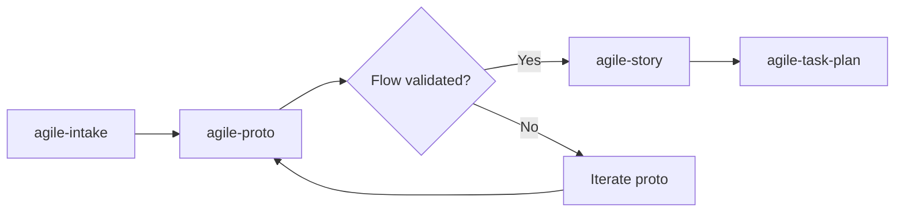

# agile-proto

Creates standalone interactive UI prototypes using a zero-build CDN stack: z-proto shell + daisyUI (with shadcn-like theme) + Preact/htm + Tailwind v4. Prototypes validate UI flows before committing to implementation. Everything runs from CDN — no package.json, no bundler, no install step.

## When to use

- You need to validate a UI flow before implementing it in production
- You want an interactive prototype instead of static mockups
- You're exploring a user journey (login flow, checkout, onboarding wizard)
- Someone asks to "prototype", "create proto", or "mockup screens"
- You need to demo a feature concept to stakeholders

## When NOT to use

- You need production code — prototypes are throwaway; use `/agile-epic` then `/agile-task` instead
- You need static documentation — use a wiki or design tool
- You're tracking delivery — use `/agile-status` or `/agile-status`
- You need to test business logic or APIs — prototypes mock data, not real backends

## How to use

```
/agile-proto
```

Example: `/agile-proto login-flow`

## End-to-end examples

### Example 1: Prototyping an onboarding wizard

The design team wants to validate a 4-step onboarding wizard before engineering builds it:

1. Start by invoking: `/agile-proto onboarding wizard with 4 steps`
2. The skill copies templates from `skills/agile-proto/templates/` into `client-proto/`.
3. It creates route files using Preact + htm + daisyUI classes:
   - `routes/onboarding/step-1.js` — Account info
   - `routes/onboarding/step-2.js` — Team setup
   - `routes/onboarding/step-3.js` — Integration preferences
   - `routes/onboarding/step-4.js` — Confirmation
4. Each step uses daisyUI: `btn`, `input`, `select`, `card`, `steps` (progress indicator).
5. Icons via `<iconify-icon icon="lucide:arrow-right" width="16">`.
6. Mock data is inline — pre-filled forms, hardcoded team list.
7. Scenes are added to the SCENES array in `index.js` with hash navigation.
8. Serve with `bun --serve .` or `python3 -m http.server 3000`.
9. z-proto shell shows responsive presets — test on iPhone, iPad, Desktop.
10. Stakeholders click through the wizard and validate the flow.

### Example 2: Prototyping a settings page with tabs

You need to validate the info architecture for a settings page with tabs:

1. Start by invoking: `/agile-proto settings page with account, notifications, and billing tabs`
2. The skill creates:
   - `routes/settings.js` — Tab layout using daisyUI `tabs tabs-bordered`
   - Three tab content sections: Account form, Notification toggles, Billing info
3. All forms pre-filled with mock data using daisyUI classes.
4. Each tab is a scene in the SCENES array for easy navigation.

### Example 3: Prototyping a messaging inbox

You need to validate an inbox layout with conversation list and thread view:

1. Start by invoking: `/agile-proto messaging inbox with list and thread views`
2. The skill creates:
   - `components/app-shell.js` — Sidebar + header layout (custom Preact component)
   - `routes/inbox/list.js` — Conversation list with search, filters, badges
   - `routes/inbox/thread.js` — Message thread with composer
3. Uses daisyUI `card`, `badge`, `input`, `btn`, `avatar`, `chat` components.
4. Mock conversations with realistic data (names, timestamps, message previews).
5. z-proto with `figma-key` for Figma capture if design team needs the screens.

## Key stack rules

- **Zero build tools:** Everything via CDN. No package.json, no bundler.
- **CDN order matters:** `themes.css` → `daisyui.css` → `@tailwindcss/browser`. Reversing breaks styles.
- **Never use `@plugin`:** `@tailwindcss/browser` does not support plugins. Load daisyUI via `<link>` CSS.
- **daisyUI classes:** Use `btn`, `card`, `input`, `badge`, etc. Never recreate components.
- **shadcn theme:** Default to `data-theme="shadcn"` for neutral, shadcn-like appearance.
- **Icons via `<iconify-icon>`:** Never import from `lucide-react` or any icon package.
- **Preact + htm:** Use `html` tagged templates, not JSX. Files are `.js`, not `.tsx`.
- **Hash routing:** Scenes in SCENES array, navigated via `#scene-id`.
- **Mock data inline:** Forms pre-filled, lists hardcoded. Data in the route file.
- **One route per file:** Feature-based: `routes/settings.js`, `routes/inbox/list.js`.

## Workflow integration



## Tips & pitfalls

- Prototypes are throwaway. Don't architect for reuse — architect for clarity.
- Never leave blank forms. Pre-fill all mock data so reviewers can click through real scenarios.
- Use z-proto device presets to test responsive layouts (iPhone, iPad, Desktop).
- The content area inside z-proto must handle its own scroll — use `overflow-y-auto` on the main container.
- Serve with any static server — `bun --serve .`, `python3 -m http.server`, `npx serve`.
- daisyUI themes: change `data-theme="light"` on `<html>` to switch (dark, cupcake, forest, etc.).

## Chaining

- **Before:** `/agile-intake` (capture the need), `/agile-epic` (if the prototype validates a story)
- **After:** Once the flow is validated, use `/agile-epic` or `/agile-task` to plan the real implementation.
