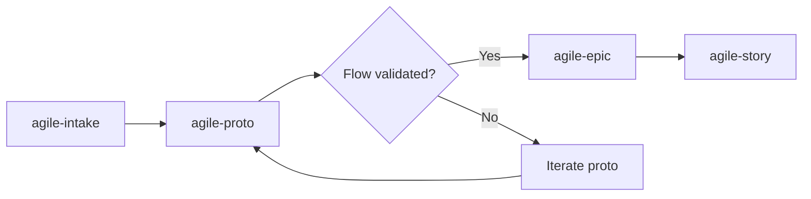

# agile-proto

Create standalone interactive UI prototypes with a zero-build CDN stack: **z-proto** shell + **Tailwind CSS v4** + **shadcn-style components** (55, ported from the original shadcn) + **Preact/htm**. Prototypes validate UI flows before committing to production implementation. Everything runs from CDN — no package.json, no bundler, no install step.

## When to use

- You need to validate a UI flow before implementing it in production.
- You want an interactive prototype instead of static mockups.
- You're exploring a user journey (login flow, checkout, onboarding wizard).
- Someone asks to "prototype", "create proto", or "mockup screens".
- You need to demo a feature concept to stakeholders or export screens into Figma.

## When NOT to use

- You need production code — prototypes are throwaway. Use `/agile-epic` then `/agile-story`.
- You need static documentation — use a wiki or design tool.
- You're tracking delivery — use `/agile-status`.
- You need to test business logic or real APIs — prototypes mock data, not backends.

## How to use

```
/agile-proto
```

Example: `/agile-proto login-flow with email + SSO`

## End-to-end examples

### Example 1: Onboarding wizard

Validate a 4-step onboarding wizard before engineering builds it:

1. Invoke: `/agile-proto onboarding wizard with 4 steps`.
2. The skill copies `skills/agile-proto/templates/` into `client-proto/`.
3. Scenes are created under `routes/onboarding/step-{1..4}.js` using the shadcn components from `components/ui/`.
4. Each step reuses `<Button>`, `<Card>`, `<Input>`, `<Label>`, `<Progress>` from `~/components/ui/<name>.js` — no local recreation.
5. Icons via `<${Icon} icon="lucide:arrow-right" />`.
6. Mock data inline — pre-filled forms, hardcoded team list.
7. Scenes registered in the `SCENES` array in `index.js`; navigation by hash (`#step-1`).
8. Serve with `bunx serve -s .`.
9. The z-proto shell ships device presets — test on iPhone, iPad, Desktop.
10. Stakeholders click through the wizard and validate the flow.

### Example 2: Settings page with tabs

1. Invoke: `/agile-proto settings page with account, notifications, and billing tabs`.
2. The skill creates `routes/settings.js` using `<TabsList>`/`<TabsTrigger>` and the form primitives (`<Field>`, `<Input>`, `<Switch>`).
3. All forms pre-filled with mock data.
4. Each tab is rendered conditionally based on `useState`.

### Example 3: Messaging inbox with Figma export

Validate an inbox layout and hand it off to design:

1. Invoke: `/agile-proto messaging inbox with list and thread views`.
2. The skill creates:
   - `routes/inbox/list.js` — conversation list using `<Card>`, `<Badge>`, `<Input>`, `<Avatar>`.
   - `routes/inbox/thread.js` — message thread with `<Textarea>` composer.
3. Set `figma-key="YOUR_KEY"` on `<z-proto>` in `index.html`.
4. Click the **Figma** button in the z-proto header → `Cmd+V` in Figma desktop → pastes as editable frames (native Figma feature, no plugin).

## Key stack rules

- **Zero build tools.** Everything via CDN. No package.json, no bundler, no install step.
- **Always import components from `~/components/ui/<name>.js`.** The 55-component shadcn catalog is already implemented — `Button`, `Dialog`, `Card`, `Sidebar`, `Table`, `Toggle`, etc. Never recreate them locally. Never import from `lucide-react`, `@radix-ui`, daisyUI.
- **Icons via `<Icon>`.** `<${Icon} icon="lucide:search" />`. The component wraps `<iconify-icon>`.
- **Preact + htm.** `html` tagged templates, not JSX. Files are `.js`, not `.tsx`.
- **Hash routing.** Scenes in the `SCENES` array in `index.js`, navigated via `window.location.hash` (`#dashboard`, `#settings`, etc.).
- **AppShell by default.** Every scene renders inside `<AppShell>` (sidebar + topbar) unless marked `noShell: true`.
- **Behavior via native HTML5/CSS.** Dialogs use `<dialog>`; accordions use `<details>`; popovers use the native popover API; tooltips are CSS-only. No Radix, no JS positioning.
- **Colors via shadcn variables.** `bg-primary`, `text-muted-foreground`, `border-sidebar-border` — never raw colors.
- **Mock data inline.** Forms pre-filled, lists hardcoded. Data lives in the route file.
- **One scene per file.** Feature-based: `routes/inbox/list.js`, etc.

See `SKILL.md` for the full stack details, the component catalog (55 entries), the Figma export flow, and the checklist.

## Workflow integration



## Tips & pitfalls

- Prototypes are throwaway. Don't architect for reuse — architect for clarity.
- Never leave blank forms. Pre-fill mock data so reviewers can click through real scenarios.
- Use z-proto device presets to test responsive layouts (iPhone, iPad, Desktop).
- Content inside z-proto must handle its own scroll — use `overflow-y-auto` on the scene root (`flex-1 w-full h-full overflow-y-auto`).
- Serve with any SPA-capable static server: `bunx serve -s .`, `python3 -m http.server` (hash routing works even without `-s`).
- To test the skill's templates themselves: `cd ~/.claude/skills/agile-proto/templates && bunx serve -s .`, then browse `#components` to see the full live reference of the 55 ported shadcn components.
- Figma export requires `localhost` (clipboard API needs a secure context) and up-to-date Figma desktop (native `(figh2d)` paste support).

## Chaining

- **Before:** `/agile-intake` (capture the need), `/agile-epic` (if the prototype validates a story).
- **After:** Once the flow is validated, use `/agile-epic` or `/agile-story` to plan the real implementation.
