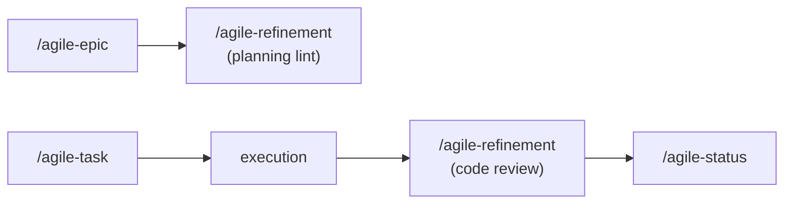

# agile-refinement

Validates planning artifacts and reviews code for quality, consistency, and completeness. Operates in two modes: planning lint (check cross-references, dependencies, completeness, consistency, format, scope conflicts, stale content) and code review (security, coherence, over-engineering, scope, quality). Use at any point in the flow as a quality gate.

## When to use

- Before starting implementation -- lint the planning artifacts for issues
- Before committing code -- review the diff for security, coherence, and quality
- When opening a pull request -- quality gate
- After AI-generated code needs human-equivalent review
- Periodically -- check for stale content, broken cross-references, or orphaned artifacts
- When merging or completing an epic -- validate all pieces fit together

## When NOT to use

- Creating planning artifacts -- use `/agile-intake`, `/agile-epic`, `/agile-task`, or `/agile-roadmap`
- Decomposing work into stories -- use `/agile-epic` (which handles decomposition directly)
- Tracking delivery progress -- use `/agile-status`
- Planning a sprint -- use `/agile-planning`

## How to use

```
/agile-refinement
```

Example: `/agile-refinement planning` or `/agile-refinement code`

## End-to-end examples

### Example 1: Linting planning artifacts before a sprint

Before sprint planning, you want to validate that all epic stories are consistent:

1. Start by invoking: `/agile-refinement planning/payment-migration/epics/01-payment-overhaul/`
2. The skill reads all files in the epic folder.
3. It checks cross-references (Origin fields), dependencies (no circular deps), completeness (required sections present), consistency (sizing matches), format (naming conventions), and stale content.
4. It produces an inline report: "Story 03 references a dependency on Story 06 which doesn't exist. Story 02 is missing acceptance criteria. Story 04 has tasks completed but status is still 'not started'."
5. You fix the issues before sprint planning.

### Example 2: Code review before committing

You've just implemented rate limiting and want a quality gate:

1. Start by invoking: `/agile-refinement`
2. The skill reads the complete diff.
3. It applies the code review checklist: security, coherence, over-engineering, scope, quality, completeness.
4. It produces a report with flagged issues and actionable suggestions.
5. You address the issues and re-run the review.

## Output

This skill does NOT produce a saved artifact. It produces an inline report with:
- Issues grouped by category
- Severity levels (red flag, warning, info)
- Specific file and line references
- Actionable suggestions

## Workflow integration



## Tips & pitfalls

- Read everything in scope before producing any output.
- Be specific with feedback. "Code looks bad" is not actionable. "Replace RateLimitError with HttpError on line 42" is.
- AI code review does not replace human code review -- it's an additional gate.
- Planning lint can be run at any time as a health check.
- Focus on security and scope first -- these cause the most real problems.

## Chaining

- **Before:** Any planning or execution skill (refinement validates their output)
- **After:** Fix the issues found, then proceed with the flow (commit, sprint planning, etc.)
