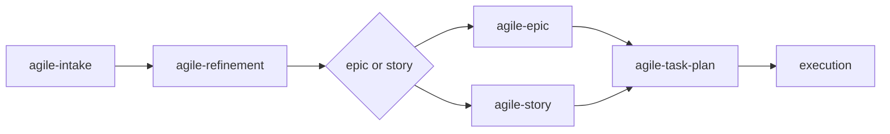

# agile-refinement

Breaks large intakes or backlog items into proportional, executable stories with clear dependencies, sizing, and implementation order. Use when a problem has been captured (intake) but is too big or ambiguous to execute directly — it decomposes by vertical value slice, not by technical layer.

## When to use

- After an `/agile-intake` that recommended refinement (large or complex)
- A backlog item is too large to execute directly
- There's ambiguity about scope, dependencies, or execution order
- Before creating an epic with several stories that need coordination
- You need to break down a quarterly objective into deliverable stories

## When NOT to use

- The item is already clear and fits in a story — use `/agile-story` directly
- The item is small and localized — use `/agile-task-plan` directly
- The problem hasn't been captured yet — use `/agile-intake` first
- You already have stories that just need execution plans — use `/agile-task-plan`

## How to use

```
/agile-refinement
```

Example: `/agile-refinement auth-migration`

## End-to-end examples

### Example 1: Refining a large intake into stories

After running `/agile-intake` for "migrate payments to Stripe," the intake recommends refinement:

1. Start by invoking: `/agile-refinement payment-migration`
2. The skill reads `planning/payment-migration/intake.md` and identifies: macro problem (migrate from legacy provider), impacted areas (billing, invoices, payouts, webhook), constraints (no downtime, PCI compliance).
3. The skill proposes decomposition by vertical value slice:
   - **Story 1:** Stripe provider setup (small) — no deps, foundational
   - **Story 2:** Webhook event handler (medium) — depends on Story 1
   - **Story 3:** Customer migration (medium) — depends on Story 1
   - **Story 4:** Payout reconciliation (large) — depends on Stories 1, 2
   - **Story 5:** Legacy decommission (small) — depends on Stories 1-4
4. It defines the implementation order: Story 1 first (unblocks others), Stories 2 and 3 in parallel, then Story 4, then Story 5.
5. It records open decisions (need to confirm Stripe plan tier) and risks (PCI audit in Q2).
6. Save to: `planning/payment-migration/refinement.md`
7. The skill offers: "Do you want me to structure this into an `/agile-epic`?" or "These 5 stories are clear enough — use `/agile-story` to detail them."

### Example 2: Refining a quarterly objective

The team has a Q2 objective: "Reduce onboarding drop-off by 40%":

1. Start by invoking: `/agile-refinement reduce onboarding drop-off`
2. The skill reads the intake and asks clarifying questions about the current funnel data.
3. It decomposes by user value slice:
   - **Story 1:** Simplify signup form (small) — remove 3 optional fields
   - **Story 2:** Add progress indicator to wizard (small) — standalone
   - **Story 3:** Implement email verification reminders (medium) — depends on email service
   - **Story 4:** Build onboarding analytics dashboard (medium) — depends on Story 3 for data
4. It identifies the critical path: Stories 1 and 2 first (quick wins), then Story 3, then Story 4.
5. Save to: `planning/onboarding-dropoff/refinement.md`

## Workflow integration



## Tips & pitfalls

- Never jump straight to implementation from refinement. Refinement produces stories or an epic, not code.
- Break by behavior/delivery (vertical slices), not by technical layer. "Stripe setup" is a good story; "backend changes" is not.
- Each story must have a clear objective and estimated size. If it can't be sized, it's not decomposed enough.
- Dependencies must be explicit. "Story B depends on Story A" — don't leave these implicit.
- If an item cannot be broken down further, register it as a risk (very large story) rather than pretending it's manageable.

## Chaining

- **Before:** `/agile-intake` (capture the problem), `/agile-roadmap` (strategic direction)
- **After:** If refinement produced several coordinated stories → `/agile-epic`. If 1-2 simple stories → `/agile-story`. If only 1 small item → `/agile-task-plan`.
