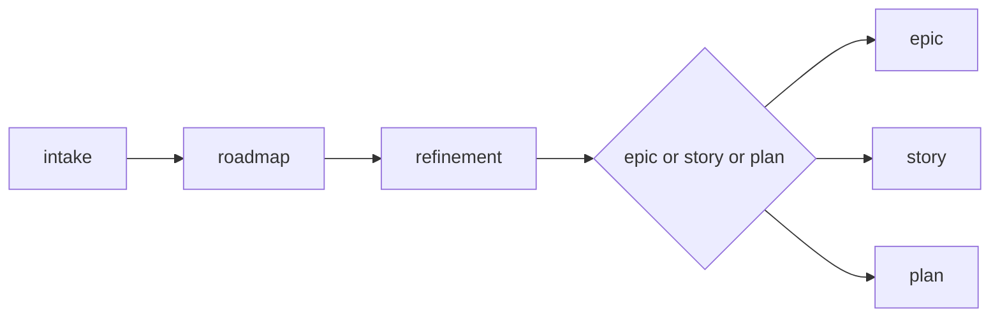

# Refinement

Use this skill to transform an intake, backlog, or large initiative into executable stories with clear dependencies, order, and acceptance criteria.

Initial context received via slash: $ARGUMENTS

If `$ARGUMENTS` is filled (e.g., file path, text, reference), use as starting point.
If empty, ask which initiative or intake will be refined.

## Language

Write the artifact in the user's language. If the user communicates in Portuguese, write in Portuguese with correct grammar and accents. If in English, write in English. When in doubt, ask the user which language to use. Templates are in English — translate headers and content to match.

## Objective

- Break large items into proportional and executable stories
- Make dependencies, unblocks, and risks explicit
- Define implementation order
- Produce backlog ready for execution (each story with objective, size, and dependency)

## When to use

- After an `/intake` that recommended refinement
- When a backlog item is too large or complex to execute directly
- When there is ambiguity about scope, dependencies, or order
- Before creating an epic with several stories

## When NOT to use

- The item is already clear and fits in a story — use `/story` directly
- The item is small and localized — use `/plan` directly
- The problem hasn't been captured yet — use `/intake` first

## Process

### 1. Analyze input material

Read the provided intake, backlog, or description. Identify:

- What is the macro problem/objective
- Which areas are impacted
- Which constraints are already known
- What is the estimated scope and complexity

### 2. Identify decomposition axes

Break by **vertical value slice**, not by technical layer:

- Each story must deliver something observable
- Prefer independent stories when possible
- Identify dependencies between stories (what unblocks what)

### 3. Propose story backlog

For each story, register:

- Name and objective
- Estimated scope (small, medium, or large)
- Dependencies (which stories it depends on)
- What validates it (summarized acceptance criteria)

### 4. Define implementation order

- Group by sprint or phase
- Identify what can run in parallel
- Highlight the critical path

### 5. Record decisions and pending items

- Decisions made during refinement
- Questions that remained open
- Identified risks

## Where to save

- If part of an initiative with a folder in `planning/`: save at `planning/<initiative>/refinement.md`
- If standalone refinement: present inline and confirm with user

## Cross-reference

Always include at the top of the artifact:

```
**Origin:** `planning/<initiative>/intake.md` (or reference of where it came from)
```

## Chaining

At the end of refinement, offer the next step:

- If refinement generated several stories → suggest `/epic` to structure the backlog
- If it generated 1-2 simple stories → suggest `/story` to detail
- If it generated only 1 small item → suggest `/plan`

Ask the user which path to follow.

## Reference template

Use `~/.agents/templates/refinement.md` as base for the artifact.

## Rules

- Never jump straight to implementation from refinement. Refinement generates stories or epic, not code.
- Break by behavior/delivery, not by technical layer.
- Each story must have a clear objective and estimated size.
- Dependencies must be explicit, not implicit.
- If an item cannot be broken, register as risk (very large story).

## Relationship with the flow



This skill acts between roadmap and creation of epics/stories/plans. It is a **mandatory step** — never skip from roadmap directly to epic. For problem capture, use `/intake`. For story detailing, use `/story`. For epics, use `/epic`.
