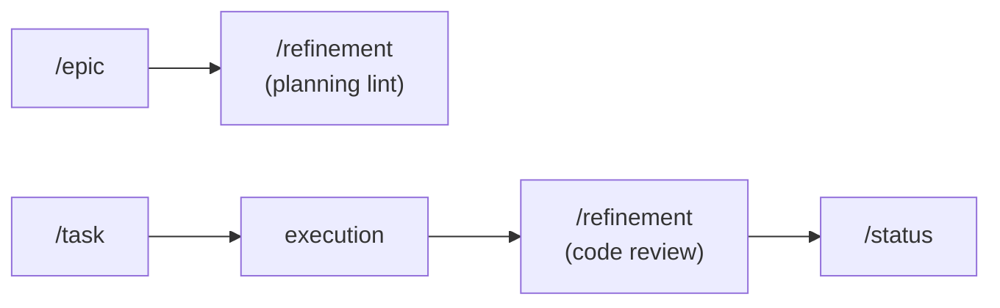

# Refinement

Use this skill to validate planning artifacts and review code quality. It operates in two modes: planning lint and code review.

Initial context received via slash: $ARGUMENTS

If `$ARGUMENTS` is filled (e.g., file path, branch, "planning", "code"), use as starting point to determine mode.
If empty, ask the user what they want to validate: planning artifacts or code changes.

## Language

Write any report output in the user's language. If the user communicates in Portuguese, write in Portuguese with correct grammar and accents. If in English, write in English. When in doubt, ask the user which language to use.

## Objective

- Validate planning artifacts for consistency, completeness, and correctness
- Review code changes for security, coherence, scope, and quality
- Catch issues before they become problems in execution
- Provide actionable, specific feedback — not generic observations

## When to use

- Before starting implementation — lint the planning artifacts
- Before committing code — review the diff
- When opening a pull request — quality gate
- When reviewing AI-generated code — human-equivalent review
- Periodically — check for stale content, broken cross-references, or orphaned artifacts
- When merging or completing an epic — validate all pieces fit together

## When NOT to use

- Creating planning artifacts — use `/intake`, `/epic`, `/task`, `/roadmap`
- Decomposing work into stories — use `/epic` (which now handles decomposition)
- Tracking delivery progress — use `/status`
- Planning a sprint — use `/planning`

## Mode 1: Planning Lint

Validates planning artifacts against the following checks:

### Cross-references
- [ ] Origin fields point to existing files
- [ ] Referenced epics, stories, and tasks exist
- [ ] File paths in cross-references are correct and files are present

### Dependencies
- [ ] Declared dependencies between stories/tasks exist
- [ ] No circular dependencies
- [ ] Dependency order is consistent with the roadmap/epic sequence

### Completeness
- [ ] Required sections are present (Context, Files, Detail, Tasks, Verification)
- [ ] No empty required fields
- [ ] Acceptance criteria are defined and verifiable
- [ ] Tasks are specific and actionable (not vague)

### Consistency
- [ ] Sizing is consistent across related artifacts (stories within an epic)
- [ ] Status fields are up to date
- [ ] Naming conventions match across files

### Format
- [ ] File naming follows convention (`00-overview.md`, `NN-story-name.md`)
- [ ] Folder structure follows convention (`planning/<initiative>/epics/NN-<epic>/`)
- [ ] Templates are properly filled (no leftover placeholder text)

### Scope conflicts
- [ ] No overlapping scope between stories in the same epic
- [ ] Out-of-scope items are not referenced as tasks

### Stale content
- [ ] No artifacts with all tasks completed but status still "in progress"
- [ ] No referenced files that have been deleted or moved
- [ ] No plans older than 30 days with incomplete tasks and no recent daily

### Process

1. Identify the scope: a single file, an epic folder, or the entire `planning/` tree.
2. Read all artifacts in scope.
3. Run each check category above.
4. Produce an inline report grouped by category with specific issues and locations.

## Mode 2: Code Review

Reviews changed code applying the checklist from `~/.agents/rules/code-review.md`:

### Security
- [ ] Inputs validated and sanitized
- [ ] No SQL injection, XSS, command injection, or SSRF
- [ ] No hardcoded secrets
- [ ] Authentication and authorization correct when applicable
- [ ] Sensitive data not exposed in logs or responses

### Project Coherence
- [ ] Follows repository patterns and conventions
- [ ] Uses existing components, utilities, and helpers
- [ ] Did not reinvent the wheel
- [ ] Naming consistent with codebase
- [ ] Imports follow project conventions

### Over-engineering
- [ ] No premature abstractions
- [ ] No error handling for impossible scenarios
- [ ] No generalization for hypothetical requirements

### Scope
- [ ] Code does only what was requested
- [ ] No refactoring of unrelated code
- [ ] No additional features not requested

### Quality
- [ ] Tests cover acceptance scenarios
- [ ] Code readable without explanatory comments
- [ ] Small functions with single responsibility
- [ ] No logic duplication
- [ ] Errors handled at system boundaries

### Completeness
- [ ] Lint passes
- [ ] Typecheck passes
- [ ] Tests pass
- [ ] Diff read in full

### Process

1. Identify the scope: branch, files, or working tree changes.
2. Read the complete diff before issuing any output.
3. Apply each check category.
4. Produce an inline report grouped by category.
5. Highlight red flags that justify immediate rejection.

## Output

This skill does NOT produce a saved artifact. It produces an inline report with:
- Issues grouped by category
- Severity: red flag (reject), warning (fix before proceeding), info (consider)
- Specific file and line references where applicable
- Actionable suggestions for each issue

## Rules

- Read everything in scope before producing any output.
- Be specific. "Code looks bad" is not actionable. "Replace `RateLimitError` with `HttpError` on line 42 of `src/middleware/rate-limit.ts`" is.
- AI code review does not replace human code review. This is an additional gate.
- Planning lint can be run at any time — it's a health check, not a ceremony.
- Never produce vague, generic feedback. Every issue must be verifiable.

## Relationship with the flow

This skill validates artifacts and code at any point in the flow. For creating planning artifacts, use `/epic` or `/task`. For tracking delivery, use `/status`.
