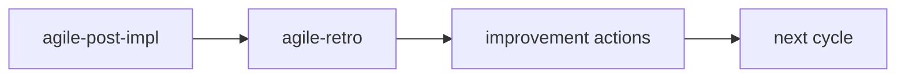

# agile-retro

Conducts a retrospective that transforms reflection into concrete improvement actions with owners and deadlines. A retro is not a venting session or meeting minutes — it's an improvement tool that separates facts from opinions, identifies root causes, and generates 2-3 actionable changes for the next cycle.

## When to use

- A sprint or delivery cycle has ended
- The team needs to reflect on what worked and what needs to change
- Before starting the next sprint — retro feeds sprint planning
- After closing a significant delivery (post-impl)

## When NOT to use

- Mid-sprint status — use `/agile-daily` or `/agile-status-report` instead
- Planning the next sprint — use `/agile-sprint-planning` instead (but retro should feed into it)
- Closing a delivery — use `/agile-post-impl` first, then retro
- You need metrics/data — use `/agile-sprint-metrics` first, then retro

## How to use

```
/agile-retro
```

Example: `/agile-retro sprint-12`

## End-to-end examples

### Example 1: Sprint 23 retro for the payments team

Sprint 23 just ended. The team delivered 3 of 5 stories and hit 2 major blockers:

1. Start by invoking: `/agile-retro Sprint 23`
2. The skill collects inputs: post-impl reports from the 3 delivered stories, dailies showing blocker patterns, sprint metrics (60% completion rate, 2 blockers averaging 3 days each).
3. It separates facts from opinions:
   - **Facts:** 3 of 5 stories delivered, 2 blockers (infra dependency, API contract change), 1 story cut from scope, completion rate 60%.
   - **Perceptions:** Team felt context-switching was the biggest productivity drain; infra team responsiveness was frustrating.
4. It analyzes:
   - **What worked:** TDD approach caught a regression early; daily standups surfaced blockers within 24h.
   - **What didn't:** External dependencies (infra team, third-party API) caused 3-day average blocker time; no Definition of Ready check before pulling stories into the sprint.
   - **Why (root cause):** Stories with external dependencies were estimated as if they were self-contained; no DoR gate.
5. It defines 2 actions (focus over quantity):
   - **Action 1:** Add "external dependency check" to DoR. Owner: tech lead. Deadline: before Sprint 24 planning.
   - **Action 2:** Map external dependencies at sprint planning and flag them as risks. Owner: scrum master. Deadline: Sprint 24 planning.
6. It connects to the next cycle: "Action 1 becomes a backlog item. Action 2 is a process change for `agile-sprint-planning`."
7. Save to: `planning/retros/retro-2026-04-11.md`

### Example 2: Retro after a project milestone

The team just finished Phase 1 of the platform migration:

1. Start by invoking: `/agile-retro platform-migration phase 1`
2. The skill reads `planning/platform-migration/post-impl-phase1.md`.
3. It structures: what worked (early staging tests caught config issues), what didn't (database migration script took 3x longer than estimated), root cause (estimation didn't account for data volume).
4. Action: add "data volume estimation" to the story template. Owner: team lead. Deadline: next sprint.
5. Save to: `planning/platform-migration/retro.md`

## Workflow integration



## Tips & pitfalls

- Retro is an improvement tool, not a venting session or meeting minutes archive.
- Actions must be specific and executable. "Improve communication" is not an action. "Add external dependency check to DoR before Sprint 24" is.
- Each action must have an owner. An action without an owner won't happen.
- Limit to 2-3 actions per retro. Many actions = none executed.
- If the same action appears in consecutive retros, the problem is deeper than the action. Discuss root cause.
- Separate facts (deliveries, metrics, timelines) from opinions ("it felt slow", "communication was bad"). Both matter, but they're different.

## Chaining

- **Before:** `/agile-post-impl` (close deliveries first), `/agile-sprint-metrics` (get data for the retro)
- **After:** Improvement actions may become `/agile-story` or `/agile-plan` items. Process changes feed back into `/agile-sprint-planning`. The next cycle starts with `/agile-sprint-planning`.
