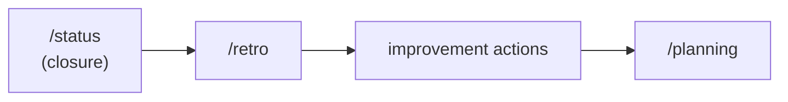

# Retrospective

Use this skill to conduct a retrospective that transforms reflection into concrete improvement actions.

Initial context received via slash: $ARGUMENTS

If `$ARGUMENTS` is filled, use as reference (e.g., period, sprint, initiative, delivery).
If empty, ask which period or delivery will be analyzed.

## Language

Write the artifact in the user's language. If the user communicates in Portuguese, write in Portuguese with correct grammar and accents. If in English, write in English. When in doubt, ask the user which language to use. Templates are in English — translate headers and content to match.

## Objective

- Separate facts from opinions
- Identify what worked and what didn't (and why)
- Generate few clear actions with owner and deadline
- Feed process improvement, not just historical memory
- Reflect on delivery outcomes (what was planned vs what happened)

## When to use

- A sprint or delivery cycle has ended
- The team needs to reflect on what worked and what needs to change
- Before starting the next sprint — retro feeds sprint planning
- After closing a significant delivery (via `/status` closure mode)
- Per-delivery reflection (what the old `/post-impl` reflection covered)
- Per-sprint reflection (standard retrospective)

## When NOT to use

- Mid-sprint status — use `/status` (checkpoint mode) instead
- Planning the next sprint — use `/planning` instead (but retro should feed into it)
- Closing a delivery with verification — use `/status` (closure mode) first, then retro
- You need metrics/data — use `/metrics` first, then retro

## Process

### 1. Collect inputs

Consult:
- Status closure reports from the period
- Status checkpoints and consolidation reports
- Sprint review (if it exists)
- Sprint metrics (if it exists)
- User or stakeholder feedback

### 2. Separate facts from opinions

- **Facts:** what happened (deliveries, blockers, deviations, metrics)
- **Perceptions:** how the team/individual felt about the process

### 3. Analyze

- **What worked well:** practices, tools, decisions that yielded results
- **What didn't work:** what caused friction, delay, or rework
- **Why:** root cause, not just symptom

### 4. Reflect on delivery outcomes

When running after a delivery closure:
- What was planned vs what was delivered
- Which decisions were right and which should change
- What would you do differently next time
- Technical debt or risks introduced

### 5. Define actions

- Limit to 2-3 actions per retro (focus > quantity)
- Each action must have:
  - Specific description
  - Responsible owner
  - Deadline
  - How to verify the improvement happened

### 6. Connect to next cycle

- How will these actions be observed in the next sprint/delivery?
- Does any action become a backlog item?

## Where to save

- `planning/<initiative>/retro.md` if it's a retro for an initiative
- `planning/retros/retro-YYYY-MM-DD.md` if it's a sprint/period retro

## Chaining

- If actions generate new tasks: suggest `/task` or `/epic`
- If actions change process: suggest updating rules or skills
- If the cycle restarts: suggest `/planning`

## Reference template

Use `~/.agents/templates/retro.md` as base.

## Rules

- Retro is not venting or meeting minutes. It's an improvement tool.
- Actions must be specific and executable, not vague ("improve communication" is not an action).
- Each action must have an owner. Action without owner won't happen.
- Limit actions to 2-3 per retro. Many actions = none executed.
- If the same action appears in consecutive retros, the problem is deeper — discuss root cause.

## Relationship with the flow

This skill closes the feedback loop. For closing deliveries, use `/status` (closure mode) first. For metrics data, use `/metrics` first. The next cycle starts with `/planning`.
