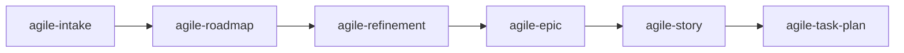

# agile-roadmap

Structures quarterly roadmaps and initiative-level roadmaps that connect strategic direction to the executable backlog. Use when you need to organize priorities, phases, dependencies, and delivery order — translating broad objectives into concrete, sequenced initiatives.

## When to use

- Organizing a quarterly plan with objectives, priorities, and risks
- Building a roadmap for a large initiative that spans multiple stories/phases
- Connecting strategic intent to the backlog (each roadmap item should point to an epic or story)
- After `/agile-intake` identified a large/strategic problem that needs direction before decomposition

## When NOT to use

- Creating a detailed execution plan — use `/agile-task-plan` or `/agile-story` instead
- Breaking down a large item into stories — use `/agile-refinement` instead
- Structuring a multi-story initiative — use `/agile-epic` instead
- Tracking in-progress deliveries — use `/agile-daily` or `/agile-status-report`

## How to use

```
/agile-roadmap
```

Example: `/agile-roadmap Q2-2026`

## End-to-end examples

### Example 1: Quarterly roadmap for Q2 2026

The team needs to align on Q2 priorities:

1. Start by invoking: `/agile-roadmap Q2 2026`
2. The skill asks: "What are the main objectives for the quarter? Any existing intakes or initiatives?"
3. You provide: "Three priorities: (1) launch payments MVP, (2) reduce onboarding drop-off, (3) infrastructure reliability."
4. The skill structures the quarterly roadmap:
   - **Objective:** Q2 2026 — Launch revenue-generating features and stabilize platform
   - **Initiative 1: Payments MVP** (value: first revenue, risk: Stripe integration timeline, progress signal: first transaction processed)
   - **Initiative 2: Onboarding optimization** (value: 40% drop-off reduction, risk: unknown root cause, progress signal: funnel analytics live)
   - **Initiative 3: Infra reliability** (value: 99.9% uptime, risk: legacy DB migration, progress signal: zero critical incidents)
   - **Order:** Payments first (unblocks revenue), Onboarding in parallel (quick wins), Infra as sustaining
   - **Risks:** Stripe API changes, hiring delay for backend, Q2 PCI audit
   - **Out of scope:** Mobile app, social features, data warehouse
5. Each initiative points to its corresponding epic or story.
6. Save to: `planning/roadmaps/Q2-2026.md`
7. The skill offers: "Do you want me to refine Initiative 1 with `/agile-refinement`?"

### Example 2: Initiative roadmap for the payments overhaul

After the intake and refinement, the payments initiative needs a phased delivery plan:

1. Start by invoking: `/agile-roadmap payment-system-overhaul`
2. The skill reads `planning/payment-system-overhaul/intake.md` and the refinement.
3. It structures the initiative roadmap:
   - **Phase 1 (Weeks 1-3):** Stripe integration + webhook handler (parallel tracks)
   - **Phase 2 (Weeks 4-6):** Payout reconciliation + customer migration
   - **Phase 3 (Week 7):** Legacy provider decommission
   - **Critical path:** Stripe integration → webhook handler → payout reconciliation
   - **Intermediate validation:** End of Phase 1 = first successful test transaction
4. Save to: `planning/payment-system-overhaul/roadmap.md`

## Workflow integration



## Tips & pitfalls

- A roadmap focuses on results and capabilities, not extensive technical task lists. "Launch payments MVP" is good; "implement 47 API endpoints" is not.
- Every roadmap item must indicate expected value, dependencies, and a progress signal (how you'll know it's working).
- Show what is a commitment, what is a risk, and what is outside the period. Don't hide uncertainty.
- Each initiative should point to a corresponding epic or story. Roadmaps without links to the backlog are fiction.

## Chaining

- **Before:** `/agile-intake` (capture the problem and strategic direction)
- **After:** `/agile-refinement` (break down the first initiative), `/agile-epic` (structure the backlog)
