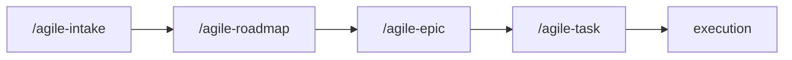

# agile-roadmap

Structures quarterly roadmaps and initiative-level roadmaps that connect strategic direction to the executable backlog. Use when you need to organize priorities, phases, dependencies, and delivery order -- translating broad objectives into concrete, sequenced initiatives.

## When to use

- Organizing a quarterly plan with objectives, priorities, and risks
- Building a roadmap for a large initiative that spans multiple stories/phases
- Connecting strategic intent to the backlog (each roadmap item should point to an epic)
- After `/agile-intake` identified a large/strategic problem that needs direction before decomposition

## When NOT to use

- Creating a detailed execution plan -- use `/agile-task` instead
- Decomposing a large item into stories -- use `/agile-epic` instead
- Tracking in-progress deliveries -- use `/agile-status`

## How to use

```
/agile-roadmap
```

Example: `/agile-roadmap Q2-2026`

## End-to-end examples

### Example 1: Quarterly roadmap for Q2 2026

The team needs to align on Q2 priorities:

1. Start by invoking: `/agile-roadmap Q2 2026`
2. The skill asks: "What are the main objectives for the quarter? Any existing intakes or initiatives?"
3. You provide: "Three priorities: (1) launch payments MVP, (2) reduce onboarding drop-off, (3) infrastructure reliability."
4. The skill structures the quarterly roadmap with initiatives, order, risks, and out-of-scope items.
5. Each initiative points to its corresponding epic.
6. Save to: `planning/roadmaps/Q2-2026.md`
7. The skill offers: "Do you want me to decompose Initiative 1 with `/agile-epic`?"

### Example 2: Initiative roadmap for the payments overhaul

After the intake, the payments initiative needs a phased delivery plan:

1. Start by invoking: `/agile-roadmap payment-system-overhaul`
2. The skill reads `planning/payment-system-overhaul/intake.md`.
3. It structures the initiative roadmap with phases, critical path, and intermediate validations.
4. Save to: `planning/payment-system-overhaul/roadmap.md`

## Workflow integration



## Tips & pitfalls

- A roadmap focuses on results and capabilities, not extensive technical task lists. "Launch payments MVP" is good; "implement 47 API endpoints" is not.
- Every roadmap item must indicate expected value, dependencies, and a progress signal.
- Show what is a commitment, what is a risk, and what is outside the period.
- Each initiative should point to a corresponding epic. Roadmaps without links to the backlog are fiction.

## Chaining

- **Before:** `/agile-intake` (capture the problem and strategic direction)
- **After:** `/agile-epic` (decompose the first initiative into stories)
