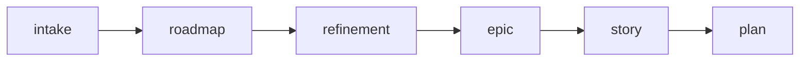

# Roadmap Planning

Use this skill to transform broad objectives into clear, prioritized roadmaps connected to the executable backlog.

Initial context received via slash: $ARGUMENTS

If `$ARGUMENTS` is filled, use as starting point (e.g., intake, initiative list, period).
If empty, ask for the roadmap objective.

## Scope
- `quarterly roadmap`: direction alignment, period objectives, and macro priorities
- `roadmap by epic`: phases, stories, unblocks, and delivery order for an initiative

## Operating rules
- Roadmap must focus on results and capabilities, not extensive technical lists.
- Every roadmap item must indicate expected value, dependencies, and progress signal.
- The roadmap must show what is a commitment, what is a risk, and what is outside the period.
- Whenever possible, each initiative should point to a corresponding epic or story.

## How to build quarterly roadmap
1. Declare the period objective.
2. List 2-5 main initiatives.
3. Order initiatives by dependency and value.
4. Register risks, constraints, and items outside commitment.
5. Validate that the quarter's narrative is observable.

## How to build roadmap by epic
1. Declare the epic objective.
2. Define phases or delivery waves.
3. Relate stories by phase.
4. Make unblocks, risks, and intermediate validations explicit.
5. Confirm that the roadmap guides execution without replacing plans.

## Where to save

- Quarterly roadmap: `planning/roadmaps/Q<N>-YYYY.md`
- Initiative roadmap: `planning/<initiative>/roadmap.md`

## Chaining

At the end of the roadmap, offer:
- "Do you want me to run `/refinement` for the first initiative?"
- "Do you want me to create the `/epic`?"

## Template

Use `~/.agents/templates/roadmap.md` as base.

## Relationship with the flow

This skill connects strategy and execution. For refinement, use `/refinement`. For epics, use `/epic`.
