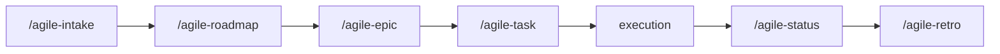

# agile-router

Routes to the appropriate agile skill based on context. Covers three areas: planning (what artifact to create), ceremonies (where in the sprint cycle), and tracking (how to report progress). Use when you need guidance on which skill to use.

## When to use

- You have a request or problem and don't know which skill to use
- You need to decide between task, epic, roadmap, or intake
- You're not sure which ceremony to run (planning, review, retro)
- You need tracking but aren't sure which mode (checkpoint, consolidation, closure)

## When NOT to use

- You already know which skill you need -- invoke it directly
- You need to create an artifact -- use the specific skill
- You need to implement code -- use `/agile-task` for the plan first

## How to use

```
/agile-router
```

Example: `/agile-router add multi-language support to onboarding`

## End-to-end examples

### Example 1: Deciding the right artifact

"Add multi-language support to the onboarding flow":

1. Start by invoking: `/agile-router add multi-language support to onboarding`
2. The router evaluates: large initiative, multiple stories needed.
3. Recommends: `/agile-epic` to decompose and structure.

### Example 2: Deciding the ceremony

"Sprint just ended, what do we do?":

1. Start by invoking: `/agile-router`
2. The router asks where you are in the cycle.
3. Recommends the sequence: `/agile-review` -> `/agile-retro` -> `/agile-planning`

### Example 3: Deciding the tracking mode

"What's the status on the auth refactor?":

1. Start by invoking: `/agile-router`
2. The router asks what type of tracking.
3. Recommends: `/agile-status` (consolidation mode) for a mid-flight summary.

## Available skills

| Skill | Purpose |
|---|---|
| `/agile-intake` | Capture vague problems |
| `/agile-roadmap` | Strategic direction |
| `/agile-epic` | Decompose and structure initiatives |
| `/agile-task` | Execution plan for localized changes |
| `/agile-refinement` | Validate artifacts and review code |
| `/agile-status` | Track progress (checkpoint, consolidation, closure) |
| `/agile-planning` | Sprint planning |
| `/agile-review` | Sprint review and demo |
| `/agile-metrics` | Sprint metrics |
| `/agile-retro` | Retrospective |
| `/agile-proto` | Interactive UI prototypes |
| `/agile-onboarding` | New member onboarding |

## Workflow integration



## Tips & pitfalls

- This is a router -- it evaluates and directs, but doesn't produce artifacts.
- If the problem isn't clear, it will suggest `/agile-intake` before routing.
- If you already know which skill you need, skip the router and go directly.
- Don't overthink sizing. If it touches a few files, it's a task. If it needs multiple coordinated stories, it's an epic.

## Chaining

- **Before:** Any context that needs routing
- **After:** Routes to the recommended skill
