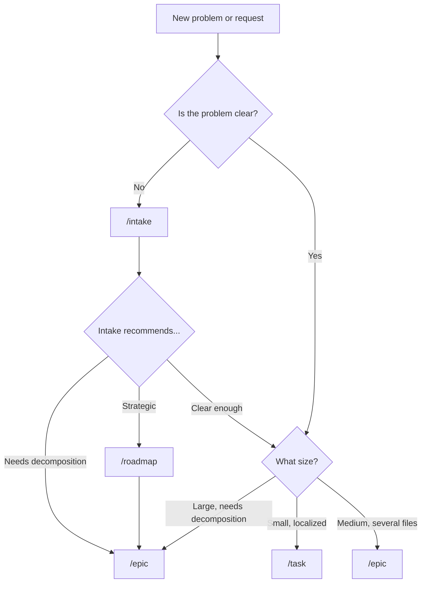
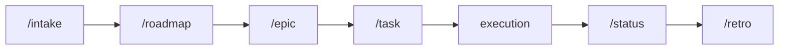

# Router

Use this skill to decide which agile skill is appropriate and get directed to the correct one.

Initial context received via slash: $ARGUMENTS

If `$ARGUMENTS` is filled, use as context to determine the right skill.
If empty, ask the user what they need help with.

## Scope

This skill replaces both the planning router and the ceremonies router. It covers three areas:

| Area | Question | Skills |
|---|---|---|
| What to create | What planning artifact fits this work? | `/intake`, `/roadmap`, `/epic`, `/task` |
| What ceremony to run | Where are we in the sprint cycle? | `/planning`, `/review`, `/retro` |
| What to track | How should I report progress? | `/status` (checkpoint, consolidation, closure) |

## Decision tree

### Planning: What artifact do I need?

> **Note:** `/epic` now handles both the epic overview and story decomposition. There is no separate story skill. Medium work that needs richer acceptance criteria goes through `/epic` for structure, or directly to `/task` if it's a single vertical delivery.

### Ceremonies: Where am I in the cycle?

- **Starting a sprint?** → `/planning`
- **Sprint just ended?** → `/review` (demo deliveries) then `/retro` (reflect on process)
- **Backlog items unclear?** → `/epic` (decompose) or run `/refinement` (validate)
- **Need metrics?** → `/metrics` (before review or retro)

### Tracking: How do I report progress?

- **Quick daily checkpoint?** → `/status` (checkpoint mode)
- **Period or milestone consolidation?** → `/status` (consolidation mode)
- **Delivery finished?** → `/status` (closure mode)

## Light sizing

> **Internal reference for AI agent — not exposed to users.** Use plain language when communicating the recommendation.

| Size | Description | Artifact | Skill |
|---|---|---|---|
| Extra small | Localized adjustment, 1 file, low risk | Task | `/task` |
| Small | Small delivery, few files, simple validation | Task | `/task` |
| Medium | Vertical delivery, several files, moderate validation | Epic story file or Task | `/epic` or `/task` |
| Large | Multiple coordinated stories, needs decomposition | Epic | `/epic` |
| Extra large | Multi-story initiative, coordination needed | Epic | `/epic` |

## Process

1. Listen to the user's context.
2. Determine which area applies: planning, ceremony, or tracking.
3. Apply the decision tree for that area.
4. Recommend the specific skill with a brief explanation.
5. Confirm with the user before they proceed.

## Rules

- This is a router skill — it evaluates and directs, but does not produce artifacts.
- If the problem isn't clear, suggest `/intake` before routing.
- Use plain language when explaining the recommendation. Do not reference size codes.
- Always confirm the recommendation with the user.

## Available skills

| Skill | Purpose |
|---|---|
| `/intake` | Capture vague problems |
| `/roadmap` | Strategic direction and quarterly planning |
| `/epic` | Structure initiatives, decompose into stories |
| `/task` | Execution plan for localized changes |
| `/refinement` | Validate planning artifacts and review code |
| `/status` | Track progress (checkpoint, consolidation, closure) |
| `/planning` | Sprint planning ceremony |
| `/review` | Sprint review and demo |
| `/metrics` | Quantitative sprint metrics |
| `/retro` | Retrospective with improvement actions |
| `/proto` | Interactive UI prototypes |
| `/onboarding` | New team member onboarding |
| `/router` | This skill — guidance on which skill to use |

## Relationship with the flow

This skill is a router. It evaluates and directs, but does not produce the final artifact. For specific work, use the recommended skill directly.
