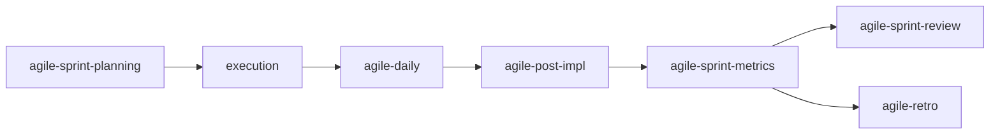

# agile-sprint-metrics

Consolidates objective, quantitative metrics from sprint artifacts — delivery rate, quality indicators, flow metrics, and process adherence. Use before a retro or sprint review to ground discussions in data instead of impressions, and to identify trends across sprints.

## When to use

- At the end of a sprint, before the sprint review or retro
- The team needs data to discuss performance (instead of gut feelings)
- Comparing sprints to identify trends (improving, degrading, stable)
- Doubts about whether declared capacity is calibrated correctly
- Feeding quantitative data into `/agile-retro` or `/agile-sprint-review`

## When NOT to use

- During the sprint for status updates — use `/agile-daily` instead
- Closing a specific delivery — use `/agile-post-impl` instead
- Planning the next sprint — use `/agile-sprint-planning` instead (though metrics feed into it)
- Qualitative reflection — use `/agile-retro` instead (but metrics provide the data for it)

## How to use

```
/agile-sprint-metrics
```

Example: `/agile-sprint-metrics sprint-12`

## End-to-end examples

### Example 1: Sprint 23 metrics for the payments team

The sprint just ended and the retro is tomorrow. You need data:

1. Start by invoking: `/agile-sprint-metrics Sprint 23`
2. The skill collects data from sprint artifacts:
   - Sprint planning: 5 stories committed
   - Issues: 8 opened, 5 closed, 3 still open
   - Dailies: 4 of 5 held, 2 blockers logged
   - Post-impl reports: 3 of 5 generated
3. It calculates metrics and produces the report:

   **Delivery:**
   - Planned: 5 stories
   - Delivered: 3 stories (60%)
   - Added during sprint: 1 story (scope creep)
   - Removed: 0

   **Quality:**
   - Bugs during sprint: 2
   - Bugs post-delivery: 0
   - Lint: passed, Typecheck: passed, Tests: 1 failure (fixed before close)

   **Flow:**
   - Blockers: 2 (average duration: 3 days)
   - Average time per story: 4.2 days
   - Reopenings: 1 story (came back from done)

   **Process:**
   - Dailies held: 4 of 5
   - Post-impl reports: 3 of 5
   - Issues closed: 5 of 8

   **Trend vs Sprint 22:**
   - Completion rate: down (60% vs 80%)
   - Blockers: more (2 vs 0)
   - Scope creep: present (1 added vs 0 last sprint)

   **Highlights for retro:**
   - Positive: No post-delivery bugs, all verification steps passed
   - Attention: blockers caused 3-day average delays, completion rate dropped 20pp
   - Action suggestion: investigate blocker root cause in retro

4. Present to the team before the retro.

### Example 2: Quarterly trend analysis

After 6 sprints, the team wants to see if velocity is improving:

1. Start by invoking: `/agile-sprint-metrics Q1 2026`
2. The skill collects data from Sprints 18-23 and calculates trends:
   - Completion rate: 70%, 75%, 72%, 80%, 76%, 60% — dipped in Sprint 23
   - Blockers per sprint: 1, 0, 2, 0, 1, 2 — spiking when external dependencies hit
   - Scope creep: rare in Sprints 18-22, 1 story added in Sprint 23
3. It highlights: "Sprint 23 is an outlier due to external blockers. Sprints 18-22 show steady 70-80% completion."

## Workflow integration



## Tips & pitfalls

- Metrics are reflection tools, not judgment tools. The goal is to improve the process, not evaluate people.
- Never manipulate numbers to look better. If the sprint was bad, the numbers should show it — and the retro should discuss why.
- Compare sprints carefully. Different contexts (vacations, external blockers, team changes) can invalidate direct comparisons.
- Metrics without discussion are useless. Always present within a `/agile-retro` or `/agile-sprint-review`, never as a standalone report.
- Don't round numbers to look better. Precision matters more than appearance.

## Chaining

- **Before:** Sprint planning, dailies, post-impl reports (these are the data sources)
- **After:** Feeds into `/agile-sprint-review` (show what was delivered), `/agile-retro` (discuss what to improve), and `/agile-sprint-planning` (calibrate capacity).
