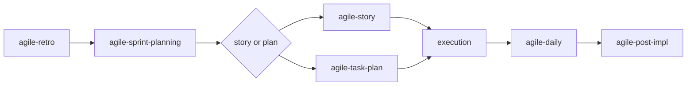

# agile-sprint-planning

Plans a sprint by selecting backlog items, declaring an objective, recording capacity and constraints, and defining execution order. Use at the beginning of a work cycle to align on what will be delivered and how dependencies will be managed.

## When to use

- Starting a new sprint or work cycle
- After refinements are done and stories are ready for execution
- After a retro (retro improvement actions may become sprint items)
- You need to define what the team commits to delivering this cycle

## When NOT to use

- Mid-sprint status — use `/agile-daily` instead
- Breaking down large items — use `/agile-refinement` or `/agile-epic` first
- Closing a delivery — use `/agile-post-impl` instead
- Reflecting on a past sprint — use `/agile-retro` or `/agile-sprint-metrics`

## How to use

```
/agile-sprint-planning
```

Example: `/agile-sprint-planning sprint-13`

## End-to-end examples

### Example 1: Planning Sprint 24 for the payments team

After Sprint 23's retro identified improvement actions and the backlog has refined stories:

1. Start by invoking: `/agile-sprint-planning Sprint 24`
2. The skill asks: "Which backlog, epic, or initiative will this sprint serve?"
3. You point to `planning/payment-system-overhaul/epic.md` and last sprint's retro actions.
4. The skill reads the epic (5 stories, Stories 1-2 completed) and the retro (add external dependency check to DoR).

   **Step 1 — Declare objective:**
   "Sprint 24: Deliver payout reconciliation and begin customer migration."

   **Step 2 — Review backlog:**
   - Story 3: Payout reconciliation (medium) — depends on Story 2 ✅
   - Story 4: Customer migration (large) — depends on Story 1 ✅
   - Retro action: Add external dependency check to DoR (small)

   **Step 3 — Select items:**
   | Item | Size | Value | Dependencies |
   |---|---|---|---|
   | Payout reconciliation | medium | Unblocks provider decommission | None |
   | Customer migration (start) | large | Critical path | Stripe setup ✅ |
   | DoR update: external deps | small | Process improvement | None |

   **Step 4 — Validate Definition of Ready:**
   - Payout reconciliation: objective ✅, scope ✅, files mapped ✅, acceptance criteria ✅ — **Ready**
   - Customer migration: objective ✅, scope ✅, files mapped ✅, acceptance criteria ❌ (still has open question about migration strategy) — **Not ready** → goes back to refinement for the migration question, but the start can proceed
   - DoR update: Ready ✅

   **Step 5 — Order execution:**
   1. DoR update (small, quick win)
   2. Payout reconciliation (medium, critical path)
   3. Customer migration start (partial, while reconciliation finishes)

   **Step 6 — Commitments:**
   - Capacity: 8 dev-days (1 dev, 2 weeks)
   - Committed: DoR update + Payout reconciliation + Customer migration start
   - Postponed: Customer migration full (needs acceptance criteria completed)

5. Save to: `planning/sprints/sprint-2026-04-11.md`
6. The skill suggests: "Do you want to detail 'Payout reconciliation' with `/agile-story`?"

### Example 2: Quick sprint planning for a solo dev

A solo dev is starting a 1-week cycle:

1. Start by invoking: `/agile-sprint-planning week of April 11`
2. The dev lists 3 small items from the backlog.
3. The skill validates DoR, checks capacity (5 dev-days), and selects 2 items.
4. It defines execution order: first the bug fix (blocks features), then the small feature.
5. Save to: `planning/sprints/sprint-2026-04-11.md`

## Workflow integration



## Tips & pitfalls

- Don't select more items than capacity allows. Over-commitment generates frustration and inconsistency.
- Every item must have Definition of Ready (DoR). Without DoR, it doesn't enter the sprint — it goes back to refinement.
- The sprint objective must be observable. "Improve the system" is not. "Deliver payout reconciliation" is.
- Make dependencies explicit. Don't assume "it will fit" — check what each story depends on.
- Sprint planning feeds execution. If planning doesn't generate clarity, execution will suffer.

## Chaining

- **Before:** `/agile-refinement` (ensure items have DoR), `/agile-retro` (improvement actions become sprint items)
- **After:** `/agile-story` or `/agile-task-plan` (detail the first sprint item), then execution begins
