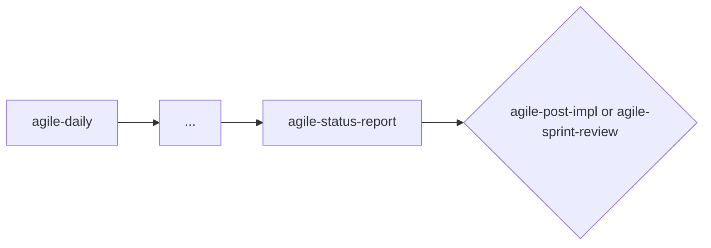

# agile-status-report

Consolidates the progress of a period or milestone into an objective report showing what's completed, what's in progress, deviations, risks, and next steps. Use when you need a broader view than a daily update but aren't ready to formally close a delivery — it's the mid-flight check-in that keeps stakeholders aligned.

## When to use

- You need a consolidated view of initiative progress (weekly, biweekly, milestone)
- Stakeholders ask "where are we?" on an initiative
- Mid-epic or mid-sprint — you need visibility beyond daily tracking
- Before a sprint review, to prepare the status snapshot
- When the period is too long for daily tracking but not yet ready for post-impl

## When NOT to use

- Quick daily status — use `/agile-daily` instead
- Closing a completed delivery — use `/agile-post-impl` instead
- End-of-sprint reflection — use `/agile-retro` for process, `/agile-sprint-review` for results
- Planning new work — use `/agile-plan` or `/agile-story` instead

## How to use

```
/agile-status-report
```

Example: `/agile-status-report auth-epic`

## End-to-end examples

### Example 1: Biweekly status report for the payments initiative

Two weeks into the payments epic, the product owner asks "where are we?":

1. Start by invoking: `/agile-status-report payment-system-overhaul`
2. The skill asks: "Which period or initiative?" and "Any specific milestone?"
3. You provide: "Payments overhaul, 2 weeks in, Phase 1."
4. The skill collects data from:
   - Dailies from the last 2 weeks
   - Active plans and their checklists (3 of 7 tasks checked off)
   - Epic stories and statuses (Story 1: completed, Story 2: in progress, Story 3: not started)
   - Git log (24 commits, 3 PRs merged)

5. It consolidates:

   **Completed:**
   - Stripe provider integration (Story 1) — all acceptance criteria met
   - Webhook event handler (Story 2) — 80% complete, pending retry logic

   **In progress:**
   - Payout reconciliation (Story 3) — started, blocked on bank API docs

   **Deviations:**
   - Story 2 scope expanded (added idempotency), approved mid-sprint
   - Customer migration moved from Phase 2 to Phase 3

   **Risks and blockers:**
   - Bank API documentation blocked (owner: infra team, next action: follow-up meeting Monday)
   - PCI audit in Q2 may conflict with Phase 2 timeline

   **Necessary decisions:**
   - Should customer migration happen in Phase 2 or Phase 3? (impact: delays legacy decommission)

   **Next steps:**
   - Complete webhook retry logic (owner: backend dev, due: Friday)
   - Unblock bank API docs (owner: infra team, due: Monday)
   - Decide on customer migration timing (owner: product, due: next sprint planning)

6. Save to: `planning/payment-system-overhaul/status-report-2026-04-11.md`

### Example 2: Quick status for a standalone feature

You're mid-way through implementing rate limiting and someone asks for status:

1. Start by invoking: `/agile-status-report rate limiting`
2. The skill reads `.agents/plans/rate-limiting.md` and sees 3 of 5 tasks completed.
3. It produces: completed (middleware, config, tests), in progress (documentation), blocker (need ops to set rate limit thresholds). Next step: finish docs and verify in staging.
4. Presented inline (short status for a small plan).

## Workflow integration



## Tips & pitfalls

- Be honest. Don't hide deviations or delays. Stakeholders find out eventually — early honesty builds trust.
- Distinguish facts from expectations. "Was delivered on Tuesday" is a fact. "Should be delivered by Friday" is an expectation.
- Blockers must have an owner and a next action. "Blocked on X" without resolution plan is not useful.
- Keep it proportional. A 1-week report doesn't need 5 pages. Match the depth to the period.
- If there are pending decisions, highlight them explicitly. Undecided items block progress.

## Chaining

- **Before:** `/agile-daily` (dailies provide the data), `/agile-sprint-metrics` (quantitative data)
- **After:** If the period closed a delivery → `/agile-post-impl`. If the sprint ended → `/agile-sprint-review` or `/agile-retro`. If there are pending decisions → highlight for stakeholders.
