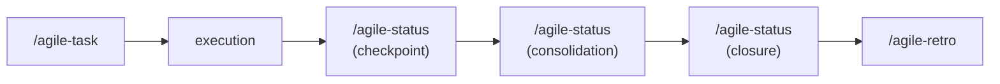

# agile-status

Tracks delivery progress in three modes -- checkpoint (quick daily update), consolidation (period report), and closure (post-implementation report). Adapts to what the user needs: a quick status, a mid-flight summary, or formal delivery closure with verification.

## When to use

- Quick daily checkpoint -- what advanced, what's blocked, next step
- Period or milestone consolidation -- what's completed, deviations, risks
- Formal delivery closure -- plan vs result, verification, handoff
- Stakeholders ask "where are we?" on an initiative
- Before a sprint review, to prepare the status snapshot
- A delivery is done and needs to be formally closed

## When NOT to use

- Planning new work -- use `/agile-task` or `/agile-epic` instead
- Decomposing large items -- use `/agile-epic` instead
- Running a ceremony -- use `/agile-planning`, `/agile-review`, or `/agile-retro`
- Reviewing code -- use `/agile-refinement` instead

## How to use

```
/agile-status
```

Example: `/agile-status auth-refactor` or `/agile-status close rate-limiting`

## End-to-end examples

### Example 1: Daily checkpoint during implementation

You're mid-sprint implementing JWT authentication:

1. Start by invoking: `/agile-status jwt-auth`
2. The skill identifies the mode as checkpoint.
3. It reads the active plan, identifies completed tasks, asks about blockers.
4. Produces: completed items, blocker (waiting on infra team, next action: sync meeting), next step (implement refresh token rotation).
5. Presented inline (short checkpoint).

### Example 2: Period consolidation for stakeholders

Two weeks into the payments epic, the product owner asks "where are we?":

1. Start by invoking: `/agile-status report payment-system-overhaul`
2. The skill identifies the mode as consolidation.
3. It collects data from checkpoints, plans, and the epic.
4. Consolidates: completed stories, in-progress work, deviations, risks, decisions needed.
5. Save to: `planning/payment-system-overhaul/status/report-2026-04-11.md`

### Example 3: Closing a delivery

The rate limiting feature is done:

1. Start by invoking: `/agile-status close rate-limiting`
2. The skill identifies the mode as closure.
3. It reads the plan, compares tasks against current state, runs verifications.
4. Produces: delivered items, pending items, verification results, remaining risks, next steps.
5. Save to: `planning/rate-limiting/status/closure-2026-04-11.md`

## Workflow integration



## Tips & pitfalls

- Every update must reflect real state, not optimistic intention.
- Blockers must have impact, owner, and next action -- "blocked on X" without resolution is useless.
- Checkpoints should take under 5 minutes. If longer, you need consolidation mode.
- Closure mode must always run lint, typecheck, and tests. Don't assume they pass.
- Keep it proportional -- a 1-week report doesn't need 5 pages.

## Chaining

- **Before:** Any planning or execution skill (status tracks progress against plans)
- **After:** Checkpoint -> continue or escalate. Consolidation -> `/agile-review` if sprint ended. Closure -> `/agile-retro` for reflection.
