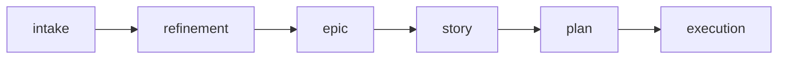

# Story

Use this skill to detail a vertical delivery into a story with clear acceptance criteria, verifiable tasks, and verification strategy.

Initial context received via slash: $ARGUMENTS

If `$ARGUMENTS` is filled (e.g., epic reference, description, issue), use as starting point.
If empty, ask what will be detailed.

## Objective

- Detail a vertical delivery with clear scope, acceptance, and verification
- Map impacted files with concrete actions
- Produce verifiable tasks in vertical slices
- Ensure the story can be implemented without additional inference

## When to use

- Work with size M (several files, moderate validation)
- Vertical delivery that needs richer acceptance criteria
- Story from an epic that needs to be detailed before execution
- Bug fix with regression risk

## When NOT to use

- Small and localized work (XS, S) — use `/plan`
- Initiative with several stories — use `/epic` first
- Problem not yet analyzed — use `/intake` or `/refinement`

## Process

### 1. Understand context

If the story comes from an epic, read the epic and identify:
- Story objective within the epic
- Dependencies with other stories
- Already known constraints

If it's a standalone story, ask the user for context.

### 2. Map scope

- What is inside the scope
- What is outside the scope
- Which files will be impacted (with action: read/alter/create)

### 3. Define acceptance criteria

Each criterion must be:
- Observable (can be verified)
- Specific (no ambiguity)
- Independent (doesn't depend on another story)

### 4. Detail tasks

- Organize by phases (preparation, implementation, closing)
- Each task must be verifiable
- Prioritize vertical slices (end-to-end), not horizontal layers

### 5. Define verification

- Lint, typecheck, test commands
- Necessary manual validations
- Expected evidence

## Where to save

- If part of an initiative: `planning/<initiative>/stories/<name>.md`
- If standalone story: `.agents/plans/<name>.md`
- Ask the user if there's doubt

## Cross-reference

Always include at the top:

```
**Origin:** `planning/<initiative>/epic.md` (or reference of where it came from)
```

## Chaining

At the end of the story, offer:

- "Do you want me to create the execution plan with `/plan`?"
- "Do you want me to create the GitHub issue?"

## Reference template

Use `~/.agents/templates/story.md` as base for the artifact.

## Required sections

Every story must contain:

1. **Context** (problem, objective, value, constraints, related issue/epic)
2. **Files** (exact paths, action, reason)
3. **Detail** (AS-IS, TO-BE, scope, acceptance criteria, dependencies, approach, risks)
4. **Tasks** (checklist in vertical phases)
5. **Verification** (commands, validations, evidence)

## Rules

- Never create story without context. If the problem is not clear, use `/intake` first.
- Acceptance criteria must be verifiable, not vague ("it must work" is not acceptance).
- Files must have exact paths, not vague areas.
- Tasks must be vertical (end-to-end), not horizontal (all UI, then all backend).
- The story must be executable without needing additional information.

## Relationship with the flow



This skill acts after epic (or directly after intake for M items). For execution plan, use `/plan`. For small items, use `/plan` directly.
