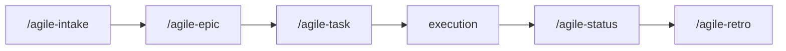

# Task

Use this skill to create a clear execution plan, ready to implement.

Initial context received via slash: $ARGUMENTS

If `$ARGUMENTS` is filled (e.g., story reference, description, issue), use as starting point.
If empty, ask what will be planned.

## Language

Write the artifact in the user's language. If the user communicates in Portuguese, write in Portuguese with correct grammar and accents. If in English, write in English. When in doubt, ask the user which language to use. Templates are in English — translate headers and content to match.

## Objective

- Create a clear and proportionally simple execution plan
- Map impacted files
- Define verifiable tasks
- Produce artifact ready for immediate implementation

## When to use

- Small and localized work — few files, low risk, single-cycle delivery
- A story from an epic that needs an operational execution plan
- Story already detailed in an epic that needs tasks mapped to files
- The problem is already clear and you just need to map out what to change

## When NOT to use

- Large work needing decomposition — use `/agile-epic`
- Problem not yet clear — use `/agile-intake`
- Multiple dependent deliveries — use `/agile-epic`
- Need strategic direction — use `/agile-roadmap`

## Process

### 1. Understand what will be done

If coming from an epic story file, read the story and extract:
- Objective
- Impacted files
- Acceptance criteria

If standalone, ask the user and explore the code to understand context.

### 2. Build the plan

Fill in the required sections:

- **Context:** problem, objective, constraints
- **Files:** exact paths with action (read/alter/create)
- **Detail:** AS-IS, TO-BE, scope, approach
- **Tasks:** verifiable checklist
- **Verification:** commands and validations

### 3. Present and wait for confirmation

Use ExitPlanMode to present the plan. Wait for explicit confirmation before implementing.

## Where to save

- If part of an initiative: `planning/<initiative>/epics/NN-<epic>/NN-story-name.md`
  - When the story file from the epic already exists, add/update the Tasks and Verification sections in place.
- If standalone: `.agents/plans/<name>.md` (for items without an epic)

> Task plans are execution artifacts. They reference their parent story or epic via the Origin field. When part of an initiative, the story file already contains context — the task adds execution detail.

## Cross-reference

If the plan comes from an epic, include at the top:

```
**Origin:** `planning/<initiative>/epics/NN-<epic>/00-overview.md`
```

## Chaining

After plan confirmation:
- Implement following the checklist
- At the end, suggest `/agile-status` (closure mode) to close the delivery

## Reference template

Use `~/.agents/templates/task.md` as base.

## Required sections

Every plan must contain:

1. **Context** (problem, objective, constraints, references)
2. **Files** (exact paths, action, reason)
3. **Detail** (AS-IS, TO-BE, scope, approach, risks)
4. **Tasks** (verifiable checklist)
5. **Verification** (lint, typecheck, tests, manual validation, acceptance)

## Rules

- Every plan must be presented before implementation (ExitPlanMode).
- Only implement after explicit user confirmation.
- Don't create a task plan for work that needs an epic (large scope with several stories).
- Files must have exact paths.
- Tasks must be verifiable, not vague.
- When completed, update `[ ]` to `[x]` according to actual progress.

## Relationship with the flow



This skill is the last step before execution. For larger problems, use `/agile-epic`. To close the delivery, use `/agile-status` (closure mode).
